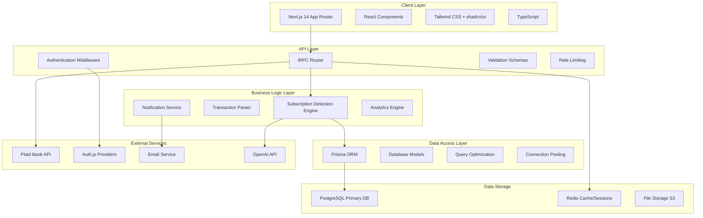
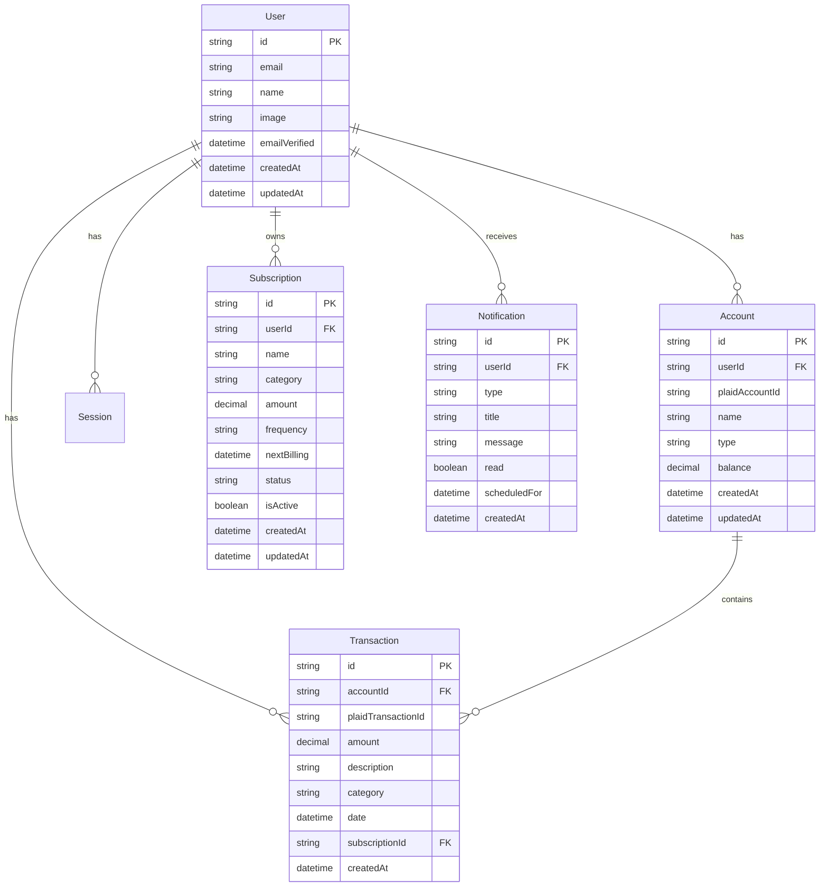
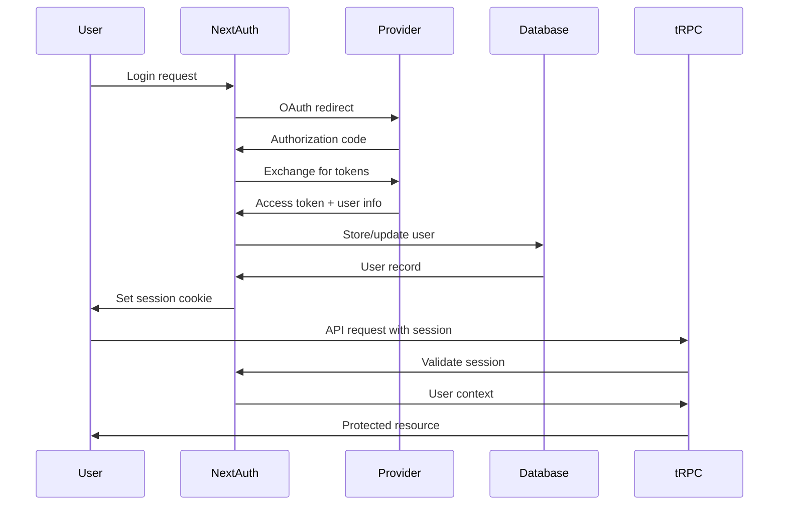
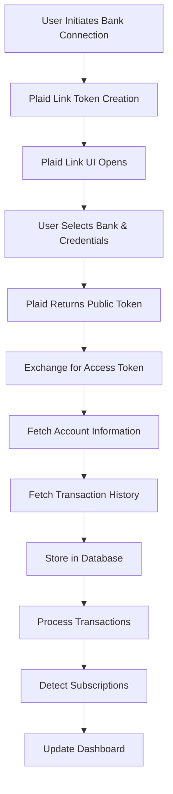
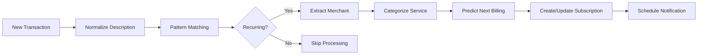
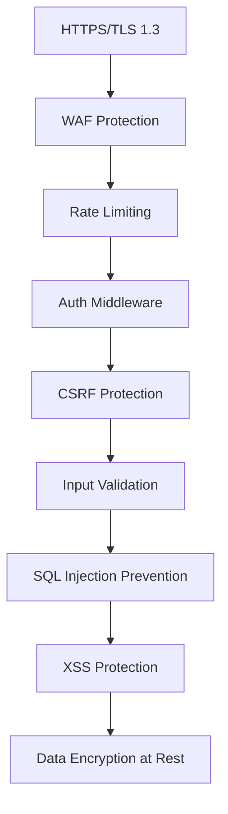
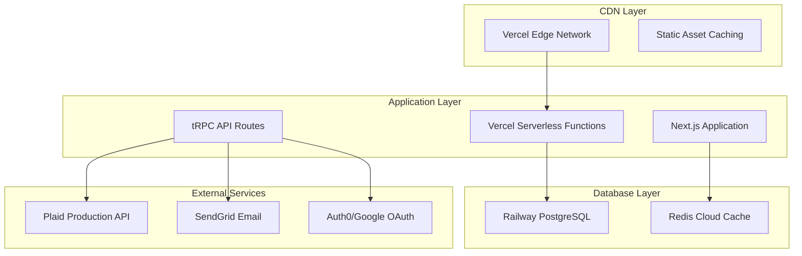

# 🏗️ SubPilot Architecture Overview

**Last Updated**: 2025-06-25 05:42 AM EDT  
**Architecture Status**: Production Ready (v0.1.8)  
**Implementation**: 95% Complete

## System Architecture

SubPilot is built using the **T3 Stack**, providing a modern, type-safe, and scalable foundation for the subscription management platform. All core systems are implemented and operational.



## Core Components

### 1. Frontend Architecture (Next.js 14)

```typescript
// App Router Structure
src/app/
├── (auth)/                 # Auth group routes
│   ├── login/             # Login page
│   └── register/          # Registration
├── (dashboard)/           # Protected dashboard routes
│   ├── page.tsx          # Main dashboard
│   ├── subscriptions/    # Subscription management
│   ├── analytics/        # Reports and insights
│   └── settings/         # User preferences
├── api/                  # API routes (tRPC)
├── globals.css          # Global styles
└── layout.tsx           # Root layout
```

**Key Frontend Features:**
- **Server Components**: Default for better performance
- **Client Components**: Interactive UI elements only
- **Streaming**: Progressive page loading
- **Route Groups**: Organized layouts by feature

### 2. API Layer (tRPC)

```typescript
// tRPC Router Structure
src/server/api/
├── root.ts              # Main router
├── routers/
│   ├── auth.ts         # Authentication routes
│   ├── plaid.ts        # Bank integration
│   ├── subscriptions.ts # Subscription CRUD
│   ├── transactions.ts  # Transaction processing
│   ├── notifications.ts # Alert management
│   └── analytics.ts    # Reporting endpoints
└── trpc.ts             # tRPC configuration
```

**API Design Principles:**
- **Type Safety**: End-to-end TypeScript
- **Input Validation**: Zod schemas for all inputs
- **Error Handling**: Structured error responses
- **Middleware**: Auth, rate limiting, logging

### 3. Database Design (PostgreSQL + Prisma)



### 4. Authentication Flow (Auth.js)



### 5. Bank Integration (Plaid)



**Plaid Integration Components:**

```typescript
// Plaid service architecture
src/lib/plaid/
├── client.ts           # Plaid client configuration
├── link.ts            # Link token generation
├── accounts.ts        # Account management
├── transactions.ts    # Transaction sync
├── webhooks.ts        # Real-time updates
└── types.ts           # Plaid type definitions
```

### 6. Subscription Detection Engine



**Detection Algorithm:**
1. **Text Normalization**: Clean transaction descriptions
2. **Pattern Recognition**: Identify recurring patterns
3. **Merchant Extraction**: Extract service provider names
4. **Frequency Analysis**: Determine billing cycles
5. **Amount Stability**: Verify consistent pricing
6. **AI Enhancement**: OpenAI classification (Phase 2)

### 7. Notification System

```typescript
// Notification architecture
src/lib/notifications/
├── triggers.ts         # Event-based triggers
├── scheduler.ts        # Cron job management
├── email.ts           # Email service integration
├── push.ts            # Browser push notifications
└── preferences.ts     # User notification settings
```

**Notification Types:**
- **Upcoming Renewals**: 7, 3, 1 day before billing
- **Price Changes**: Detected amount variations
- **Free Trial Endings**: Trial expiration alerts
- **Failed Payments**: Payment decline notifications
- **New Subscriptions**: Newly detected services

### 8. Security Architecture



**Security Measures:**
- **Authentication**: Multi-provider OAuth + magic links
- **Authorization**: Role-based access control (RBAC)
- **Data Protection**: AES-256 encryption at rest
- **API Security**: Rate limiting, CORS, CSRF tokens
- **Monitoring**: Security event logging
- **Compliance**: GDPR, PCI DSS considerations

## Deployment Architecture

### Production Environment



### Development Environment

- **Local Development**: Next.js dev server + local PostgreSQL
- **Staging**: Vercel preview deployments + Railway staging DB
- **Testing**: Jest + Playwright + Plaid sandbox

## Performance Optimizations

### Frontend Performance
- **Bundle Splitting**: Dynamic imports for large components
- **Image Optimization**: Next.js Image component with WebP
- **Caching**: SWR for client-side data fetching
- **Compression**: Gzip/Brotli compression enabled

### Backend Performance
- **Connection Pooling**: Prisma connection pooling
- **Query Optimization**: Efficient database queries
- **Caching**: Redis for frequently accessed data
- **Background Jobs**: Queue system for heavy processing

### Database Performance
- **Indexing**: Strategic database indexes
- **Partitioning**: Transaction table partitioning by date
- **Archiving**: Historical data archiving strategy
- **Monitoring**: Query performance monitoring

## Scalability Considerations

### Horizontal Scaling
- **Stateless Design**: No server-side session storage
- **Microservices Ready**: Modular tRPC router design
- **Queue System**: Background job processing
- **CDN Integration**: Global content delivery

### Vertical Scaling
- **Database Optimization**: Connection pooling and caching
- **Memory Management**: Efficient data structures
- **CPU Optimization**: Optimized algorithms
- **Storage Efficiency**: Compressed data storage

## Monitoring & Observability

```typescript
// Monitoring stack
monitoring/
├── metrics.ts          # Application metrics
├── logging.ts         # Structured logging
├── alerts.ts          # Error alerting
├── performance.ts     # Performance monitoring
└── analytics.ts       # User analytics
```

**Key Metrics:**
- **Application**: Response times, error rates, throughput
- **Database**: Query performance, connection health
- **Business**: User engagement, subscription detection accuracy
- **Infrastructure**: Memory usage, CPU utilization

## Future Architecture Considerations

### Phase 2 Enhancements
- **AI Integration**: OpenAI API for smart categorization
- **Real-time Updates**: WebSocket connections
- **Mobile API**: Dedicated mobile endpoints
- **Advanced Analytics**: Data warehouse integration

### Phase 3 Scaling
- **Microservices**: Service decomposition
- **Event-Driven**: Event sourcing architecture
- **Multi-tenant**: Enterprise account support
- **Global Deployment**: Multi-region deployment

---

This architecture provides a solid foundation for SubPilot's current needs while maintaining flexibility for future growth and feature additions.