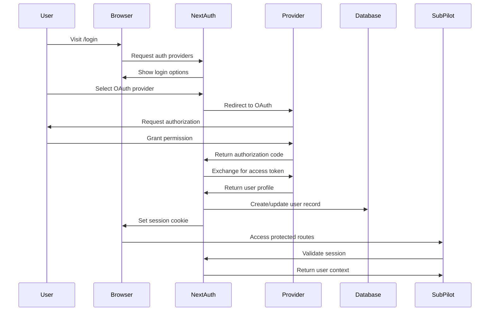

# 🔐 SubPilot Authentication Guide

## Overview

SubPilot uses **Auth.js** (formerly NextAuth.js) for secure, flexible authentication with support for multiple OAuth providers and magic link email authentication.

## Authentication Flow



## Auth.js Configuration

### Core Setup

```typescript
// src/lib/auth.ts
import { NextAuthOptions } from "next-auth";
import { PrismaAdapter } from "@auth/prisma-adapter";
import GoogleProvider from "next-auth/providers/google";
import GitHubProvider from "next-auth/providers/github";
import EmailProvider from "next-auth/providers/email";
import { db } from "~/lib/db";
import { sendVerificationRequest } from "~/lib/email";

export const authOptions: NextAuthOptions = {
  adapter: PrismaAdapter(db),
  session: {
    strategy: "database",
    maxAge: 30 * 24 * 60 * 60, // 30 days
    updateAge: 24 * 60 * 60,   // 24 hours
  },
  providers: [
    GoogleProvider({
      clientId: process.env.GOOGLE_CLIENT_ID!,
      clientSecret: process.env.GOOGLE_CLIENT_SECRET!,
      allowDangerousEmailAccountLinking: true,
    }),
    GitHubProvider({
      clientId: process.env.GITHUB_CLIENT_ID!,
      clientSecret: process.env.GITHUB_CLIENT_SECRET!,
      allowDangerousEmailAccountLinking: true,
    }),
    EmailProvider({
      server: {
        host: process.env.SMTP_HOST,
        port: parseInt(process.env.SMTP_PORT || "587"),
        auth: {
          user: process.env.SMTP_USER,
          pass: process.env.SMTP_PASS,
        },
      },
      from: process.env.FROM_EMAIL,
      sendVerificationRequest,
    }),
  ],
  pages: {
    signIn: "/auth/signin",
    verifyRequest: "/auth/verify-request",
    error: "/auth/error",
  },
  callbacks: {
    async session({ session, user }) {
      if (session.user) {
        session.user.id = user.id;
      }
      return session;
    },
    async jwt({ token, user }) {
      if (user) {
        token.userId = user.id;
      }
      return token;
    },
  },
  events: {
    async signIn({ user, account, isNewUser }) {
      console.log(`User ${user.email} signed in via ${account?.provider}`);
      
      // Track new user signup
      if (isNewUser) {
        // Send welcome email, create onboarding tasks, etc.
        await createWelcomeNotification(user.id);
      }
    },
    async signOut({ session }) {
      console.log(`User ${session?.user?.email} signed out`);
    },
  },
};

// Helper function for welcome notification
async function createWelcomeNotification(userId: string) {
  await db.notification.create({
    data: {
      userId,
      type: "welcome",
      title: "Welcome to SubPilot! 🎉",
      message: "Get started by connecting your first bank account.",
      scheduledFor: new Date(),
    },
  });
}
```

### API Route Setup

```typescript
// src/app/api/auth/[...nextauth]/route.ts
import NextAuth from "next-auth";
import { authOptions } from "~/lib/auth";

const handler = NextAuth(authOptions);

export { handler as GET, handler as POST };
```

## OAuth Provider Setup

### Google OAuth

1. **Create Google Cloud Project**
   - Visit [Google Cloud Console](https://console.cloud.google.com/)
   - Create new project or select existing

2. **Enable Google+ API**
   ```bash
   # Enable APIs
   gcloud services enable plus.googleapis.com
   ```

3. **Create OAuth Credentials**
   - Go to APIs & Services > Credentials
   - Click "Create Credentials" > "OAuth 2.0 Client IDs"
   - Set application type to "Web application"

4. **Configure Redirect URIs**
   ```
   Development: http://localhost:3000/api/auth/callback/google
   Production: https://subpilot.com/api/auth/callback/google
   ```

5. **Environment Variables**
   ```env
   GOOGLE_CLIENT_ID="your-google-client-id"
   GOOGLE_CLIENT_SECRET="your-google-client-secret"
   ```

### GitHub OAuth

1. **Create GitHub OAuth App**
   - Go to GitHub Settings > Developer settings > OAuth Apps
   - Click "New OAuth App"

2. **Configure Application**
   ```
   Application name: SubPilot
   Homepage URL: https://subpilot.com
   Authorization callback URL: https://subpilot.com/api/auth/callback/github
   ```

3. **Environment Variables**
   ```env
   GITHUB_CLIENT_ID="your-github-client-id"
   GITHUB_CLIENT_SECRET="your-github-client-secret"
   ```

### Email Magic Links

1. **SMTP Configuration**
   ```env
   # Production (SendGrid)
   SMTP_HOST="smtp.sendgrid.net"
   SMTP_PORT="587"
   SMTP_USER="apikey"
   SMTP_PASS="your-sendgrid-api-key"
   FROM_EMAIL="noreply@subpilot.com"

   # Development (Mailhog)
   SMTP_HOST="localhost"
   SMTP_PORT="1025"
   SMTP_USER=""
   SMTP_PASS=""
   FROM_EMAIL="dev@subpilot.local"
   ```

2. **Custom Email Template**
   ```typescript
   // src/lib/email.ts
   import { SendVerificationRequestParams } from "next-auth/providers/email";

   export async function sendVerificationRequest({
     identifier: email,
     url,
     provider,
   }: SendVerificationRequestParams) {
     const { host } = new URL(url);
     
     const html = `
       <!DOCTYPE html>
       <html>
         <head>
           <meta charset="utf-8">
           <title>Sign in to SubPilot</title>
         </head>
         <body style="font-family: Arial, sans-serif; max-width: 600px; margin: 0 auto;">
           <div style="background: linear-gradient(135deg, #06B6D4, #9333EA); padding: 40px; text-align: center;">
             <h1 style="color: white; margin: 0;">Sign in to SubPilot</h1>
           </div>
           <div style="padding: 40px;">
             <p>Hello!</p>
             <p>Click the link below to sign in to your SubPilot account:</p>
             <div style="text-align: center; margin: 30px 0;">
               <a href="${url}" 
                  style="background: #06B6D4; color: white; padding: 12px 24px; 
                         text-decoration: none; border-radius: 8px; display: inline-block;">
                 Sign in to SubPilot
               </a>
             </div>
             <p style="color: #666; font-size: 14px;">
               If you didn't request this email, you can safely ignore it.
               This link expires in 24 hours.
             </p>
           </div>
           <div style="background: #f8f9fa; padding: 20px; text-align: center; color: #666; font-size: 12px;">
             © ${new Date().getFullYear()} SubPilot. All rights reserved.
           </div>
         </body>
       </html>
     `;

     const text = `Sign in to SubPilot\n\nClick this link: ${url}\n\nIf you didn't request this, ignore this email.`;

     await sendEmail({
       to: email,
       subject: `Sign in to ${host}`,
       html,
       text,
     });
   }
   ```

## Authentication UI Components

### Sign In Page

```typescript
// src/app/(auth)/signin/page.tsx
"use client";

import { signIn, getProviders } from "next-auth/react";
import { useState } from "react";
import { Button } from "~/components/ui/button";
import { Input } from "~/components/ui/input";
import { Icons } from "~/components/ui/icons";

export default function SignInPage() {
  const [email, setEmail] = useState("");
  const [isLoading, setIsLoading] = useState(false);

  const handleEmailSignIn = async (e: React.FormEvent) => {
    e.preventDefault();
    setIsLoading(true);
    
    await signIn("email", {
      email,
      callbackUrl: "/dashboard",
    });
    
    setIsLoading(false);
  };

  const handleOAuthSignIn = (provider: string) => {
    signIn(provider, { callbackUrl: "/dashboard" });
  };

  return (
    <div className="min-h-screen flex items-center justify-center bg-gradient-to-br from-cyan-50 to-purple-50">
      <div className="max-w-md w-full space-y-8 p-8 bg-white rounded-xl shadow-lg">
        <div className="text-center">
          
          <h2 className="mt-6 text-3xl font-bold text-gray-900">
            Sign in to SubPilot
          </h2>
          <p className="mt-2 text-sm text-gray-600">
            Take control of your subscriptions
          </p>
        </div>

        <div className="space-y-4">
          {/* OAuth Providers */}
          <Button
            onClick={() => handleOAuthSignIn("google")}
            variant="outline"
            className="w-full"
          >
            <Icons.Google className="mr-2 h-4 w-4" />
            Continue with Google
          </Button>

          <Button
            onClick={() => handleOAuthSignIn("github")}
            variant="outline"
            className="w-full"
          >
            <Icons.GitHub className="mr-2 h-4 w-4" />
            Continue with GitHub
          </Button>

          <div className="relative">
            <div className="absolute inset-0 flex items-center">
              <span className="w-full border-t" />
            </div>
            <div className="relative flex justify-center text-xs uppercase">
              <span className="bg-white px-2 text-gray-500">
                Or continue with email
              </span>
            </div>
          </div>

          {/* Email Sign In */}
          <form onSubmit={handleEmailSignIn} className="space-y-4">
            <Input
              type="email"
              placeholder="Enter your email"
              value={email}
              onChange={(e) => setEmail(e.target.value)}
              required
            />
            <Button
              type="submit"
              className="w-full"
              disabled={isLoading}
            >
              {isLoading ? (
                <Icons.Spinner className="mr-2 h-4 w-4 animate-spin" />
              ) : (
                <Icons.Mail className="mr-2 h-4 w-4" />
              )}
              Send magic link
            </Button>
          </form>
        </div>

        <div className="text-center text-sm text-gray-600">
          By signing in, you agree to our{" "}
          <a href="/terms" className="text-cyan-600 hover:underline">
            Terms of Service
          </a>{" "}
          and{" "}
          <a href="/privacy" className="text-cyan-600 hover:underline">
            Privacy Policy
          </a>
        </div>
      </div>
    </div>
  );
}
```

### Session Provider

```typescript
// src/app/layout.tsx
import { SessionProvider } from "next-auth/react";
import { getServerSession } from "next-auth/next";
import { authOptions } from "~/lib/auth";

export default async function RootLayout({
  children,
}: {
  children: React.ReactNode;
}) {
  const session = await getServerSession(authOptions);

  return (
    <html lang="en">
      <body>
        <SessionProvider session={session}>
          {children}
        </SessionProvider>
      </body>
    </html>
  );
}
```

## Authentication Middleware

### Route Protection

```typescript
// src/middleware.ts
import { withAuth } from "next-auth/middleware";

export default withAuth(
  function middleware(req) {
    // Additional middleware logic here
    console.log("Middleware: ", req.nextauth.token);
  },
  {
    callbacks: {
      authorized: ({ token, req }) => {
        // Protect dashboard routes
        if (req.nextUrl.pathname.startsWith("/dashboard")) {
          return !!token;
        }
        
        // Protect API routes
        if (req.nextUrl.pathname.startsWith("/api/trpc")) {
          return !!token;
        }
        
        return true;
      },
    },
  }
);

export const config = {
  matcher: [
    "/dashboard/:path*",
    "/api/trpc/:path*",
    "/settings/:path*",
  ],
};
```

### tRPC Authentication

```typescript
// src/server/api/trpc.ts
import { getServerSession } from "next-auth/next";
import { authOptions } from "~/lib/auth";

export const createTRPCContext = async (opts: CreateNextContextOptions) => {
  const { req, res } = opts;
  const session = await getServerSession(req, res, authOptions);

  return {
    session,
    db,
    req,
    res,
  };
};

// Protected procedure
export const protectedProcedure = publicProcedure.use(({ ctx, next }) => {
  if (!ctx.session || !ctx.session.user) {
    throw new TRPCError({ code: "UNAUTHORIZED" });
  }
  
  return next({
    ctx: {
      session: { ...ctx.session, user: ctx.session.user },
    },
  });
});
```

## Session Management

### Client-Side Session Hooks

```typescript
// src/hooks/useAuth.ts
import { useSession, signIn, signOut } from "next-auth/react";
import { useRouter } from "next/navigation";

export function useAuth() {
  const { data: session, status } = useSession();
  const router = useRouter();

  const login = (provider?: string) => {
    signIn(provider, { callbackUrl: "/dashboard" });
  };

  const logout = async () => {
    await signOut({ callbackUrl: "/" });
  };

  const requireAuth = () => {
    if (status === "unauthenticated") {
      router.push("/auth/signin");
    }
  };

  return {
    user: session?.user,
    session,
    isLoading: status === "loading",
    isAuthenticated: status === "authenticated",
    login,
    logout,
    requireAuth,
  };
}
```

### Server-Side Session Utilities

```typescript
// src/lib/auth-utils.ts
import { getServerSession } from "next-auth/next";
import { authOptions } from "~/lib/auth";
import { redirect } from "next/navigation";

export async function getCurrentUser() {
  const session = await getServerSession(authOptions);
  return session?.user;
}

export async function requireAuth() {
  const session = await getServerSession(authOptions);
  
  if (!session?.user) {
    redirect("/auth/signin");
  }
  
  return session.user;
}

// Usage in Server Components
export default async function DashboardPage() {
  const user = await requireAuth();
  
  return (
    <div>
      <h1>Welcome back, {user.name}!</h1>
    </div>
  );
}
```

## Security Best Practices

### Environment Security

```env
# Strong secret for JWT signing
NEXTAUTH_SECRET="super-long-random-string-change-in-production"

# Secure URLs
NEXTAUTH_URL="https://subpilot.com"  # Production
NEXTAUTH_URL="http://localhost:3000"  # Development
```

### Session Security

```typescript
// Enhanced session configuration
export const authOptions: NextAuthOptions = {
  session: {
    strategy: "database",
    maxAge: 30 * 24 * 60 * 60, // 30 days
    updateAge: 24 * 60 * 60,   // Update every 24 hours
  },
  cookies: {
    sessionToken: {
      name: "next-auth.session-token",
      options: {
        httpOnly: true,
        sameSite: "lax",
        path: "/",
        secure: process.env.NODE_ENV === "production",
      },
    },
  },
  // ... rest of config
};
```

### CSRF Protection

Auth.js automatically handles CSRF protection, but you can enhance it:

```typescript
// Additional CSRF protection for API routes
import { getCsrfToken } from "next-auth/react";

export async function POST(req: Request) {
  const csrfToken = await getCsrfToken({ req });
  
  // Verify CSRF token in critical operations
  if (!csrfToken) {
    return new Response("Forbidden", { status: 403 });
  }
  
  // Continue with operation
}
```

## Testing Authentication

### Unit Tests

```typescript
// src/__tests__/auth.test.ts
import { getServerSession } from "next-auth/next";
import { authOptions } from "~/lib/auth";

jest.mock("next-auth/next");

describe("Authentication", () => {
  test("should return user session when authenticated", async () => {
    const mockSession = {
      user: {
        id: "user_123",
        email: "test@example.com",
        name: "Test User",
      },
    };
    
    (getServerSession as jest.Mock).mockResolvedValue(mockSession);
    
    const session = await getServerSession(authOptions);
    expect(session).toEqual(mockSession);
  });
});
```

### Integration Tests

```typescript
// src/__tests__/auth-flow.test.ts
import { render, screen, fireEvent } from "@testing-library/react";
import { SessionProvider } from "next-auth/react";
import SignInPage from "~/app/(auth)/signin/page";

describe("Authentication Flow", () => {
  test("should display sign-in options", () => {
    render(
      <SessionProvider session={null}>
        <SignInPage />
      </SessionProvider>
    );
    
    expect(screen.getByText("Continue with Google")).toBeInTheDocument();
    expect(screen.getByText("Continue with GitHub")).toBeInTheDocument();
    expect(screen.getByText("Send magic link")).toBeInTheDocument();
  });
});
```

## Troubleshooting

### Common Issues

**OAuth Redirect Mismatch:**
```
Error: redirect_uri_mismatch
Solution: Ensure callback URLs match exactly in OAuth provider settings
```

**Session Not Persisting:**
```
Issue: User gets signed out on page refresh
Solution: Check database adapter configuration and session strategy
```

**Email Provider Not Working:**
```
Issue: Magic link emails not sending
Solution: Verify SMTP configuration and test email service
```

### Debug Mode

```typescript
// Enable debug logging
export const authOptions: NextAuthOptions = {
  debug: process.env.NODE_ENV === "development",
  logger: {
    error(code, metadata) {
      console.error("Auth Error:", code, metadata);
    },
    warn(code) {
      console.warn("Auth Warning:", code);
    },
    debug(code, metadata) {
      console.debug("Auth Debug:", code, metadata);
    },
  },
  // ... rest of config
};
```

This authentication setup provides secure, scalable user management for SubPilot with multiple sign-in options and robust session handling.