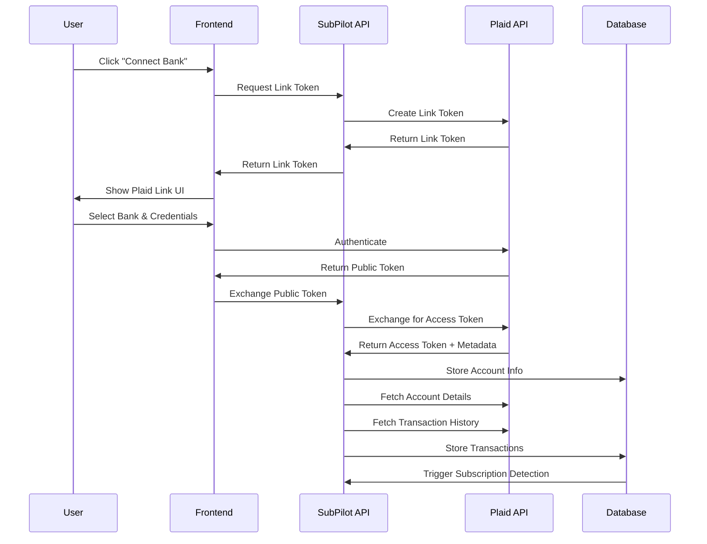

# 🏦 SubPilot Bank Integration Guide

## Overview

SubPilot uses **Plaid** as the primary bank API for secure account connectivity and transaction data retrieval. This guide covers the complete implementation of bank integration features.

## Plaid Integration Architecture



## Plaid Client Setup

### Environment Configuration

```env
# Plaid Configuration
PLAID_CLIENT_ID="your-plaid-client-id"
PLAID_SECRET="your-plaid-secret"
PLAID_ENV="sandbox"  # sandbox, development, production
PLAID_PRODUCTS="transactions,accounts,identity"
PLAID_COUNTRY_CODES="US,CA"
PLAID_REDIRECT_URI="http://localhost:3000/dashboard"

# Webhook URL for real-time updates
PLAID_WEBHOOK_URL="https://your-domain.com/api/webhooks/plaid"
```

### Plaid Client Configuration

```typescript
// src/lib/plaid.ts
import { Configuration, PlaidApi, PlaidEnvironments } from 'plaid';

const configuration = new Configuration({
  basePath: PlaidEnvironments[process.env.PLAID_ENV as keyof typeof PlaidEnvironments],
  baseOptions: {
    headers: {
      'PLAID-CLIENT-ID': process.env.PLAID_CLIENT_ID,
      'PLAID-SECRET': process.env.PLAID_SECRET,
    },
  },
});

export const plaidClient = new PlaidApi(configuration);

// Plaid configuration constants
export const PLAID_CONFIG = {
  products: (process.env.PLAID_PRODUCTS?.split(',') || ['transactions']) as Array<
    'accounts' | 'transactions' | 'identity' | 'investments'
  >,
  countryCodes: (process.env.PLAID_COUNTRY_CODES?.split(',') || ['US']) as Array<
    'US' | 'CA' | 'GB' | 'FR' | 'ES' | 'NL'
  >,
  redirectUri: process.env.PLAID_REDIRECT_URI,
  webhookUrl: process.env.PLAID_WEBHOOK_URL,
};
```

## Plaid Link Implementation

### Link Token Creation

```typescript
// src/server/api/routers/plaid.ts
import { z } from "zod";
import { createTRPCRouter, protectedProcedure } from "~/server/api/trpc";
import { plaidClient, PLAID_CONFIG } from "~/lib/plaid";
import { CountryCode, Products } from "plaid";

export const plaidRouter = createTRPCRouter({
  createLinkToken: protectedProcedure
    .query(async ({ ctx }) => {
      try {
        const response = await plaidClient.linkTokenCreate({
          user: {
            client_user_id: ctx.session.user.id,
            email_address: ctx.session.user.email!,
            phone_number: null,
          },
          client_name: "SubPilot",
          products: PLAID_CONFIG.products as Products[],
          country_codes: PLAID_CONFIG.countryCodes as CountryCode[],
          language: 'en',
          redirect_uri: PLAID_CONFIG.redirectUri,
          webhook: PLAID_CONFIG.webhookUrl,
          account_filters: {
            depository: {
              account_type: ['checking', 'savings'],
              account_subtype: ['checking', 'savings', 'money_market'],
            },
            credit: {
              account_type: ['credit'],
              account_subtype: ['credit_card'],
            },
          },
        });

        return {
          linkToken: response.data.link_token,
          expiration: response.data.expiration,
        };
      } catch (error) {
        console.error('Error creating link token:', error);
        throw new TRPCError({
          code: 'INTERNAL_SERVER_ERROR',
          message: 'Failed to create bank connection',
        });
      }
    }),

  exchangePublicToken: protectedProcedure
    .input(z.object({
      publicToken: z.string(),
      metadata: z.object({
        institution: z.object({
          name: z.string(),
          institution_id: z.string(),
        }),
        accounts: z.array(z.object({
          id: z.string(),
          name: z.string(),
          type: z.string(),
          subtype: z.string(),
        })),
      }),
    }))
    .mutation(async ({ ctx, input }) => {
      try {
        // Exchange public token for access token
        const response = await plaidClient.itemPublicTokenExchange({
          public_token: input.publicToken,
        });

        const { access_token, item_id } = response.data;

        // Get institution information
        const institutionResponse = await plaidClient.institutionsGetById({
          institution_id: input.metadata.institution.institution_id,
          country_codes: PLAID_CONFIG.countryCodes as CountryCode[],
        });

        const institution = institutionResponse.data.institution;

        // Store Plaid item
        const plaidItem = await ctx.db.plaidItem.create({
          data: {
            userId: ctx.session.user.id,
            plaidItemId: item_id,
            accessToken: access_token, // In production, encrypt this
            institutionId: institution.institution_id,
            institutionName: institution.name,
            institutionLogo: institution.logo || null,
            availableProducts: PLAID_CONFIG.products,
            billedProducts: [],
            status: 'good',
          },
        });

        // Get and store account information
        const accountsResponse = await plaidClient.accountsGet({
          access_token,
        });

        const accounts = await Promise.all(
          accountsResponse.data.accounts.map(async (account) => {
            return ctx.db.account.create({
              data: {
                userId: ctx.session.user.id,
                plaidAccountId: account.account_id,
                plaidItemId: plaidItem.id,
                name: account.name,
                officialName: account.official_name || account.name,
                type: account.type,
                subtype: account.subtype || '',
                availableBalance: account.balances.available || null,
                currentBalance: account.balances.current || 0,
                isoCurrencyCode: account.balances.iso_currency_code || 'USD',
              },
            });
          })
        );

        // Trigger initial transaction sync
        await syncTransactionsForItem(access_token, plaidItem.id, ctx.session.user.id);

        return {
          itemId: plaidItem.id,
          accounts: accounts.map(acc => ({
            id: acc.id,
            name: acc.name,
            type: acc.type,
            balance: acc.currentBalance,
          })),
        };
      } catch (error) {
        console.error('Error exchanging public token:', error);
        throw new TRPCError({
          code: 'INTERNAL_SERVER_ERROR',
          message: 'Failed to connect bank account',
        });
      }
    }),
});
```

### Frontend Link Component

```typescript
// src/components/dashboard/PlaidLink.tsx
"use client";

import React, { useCallback, useState } from 'react';
import { usePlaidLink } from 'react-plaid-link';
import { Button } from '~/components/ui/button';
import { Icons } from '~/components/ui/icons';
import { api } from '~/utils/api';
import { toast } from '~/components/ui/use-toast';

interface PlaidLinkProps {
  onSuccess?: () => void;
}

export function PlaidLink({ onSuccess }: PlaidLinkProps) {
  const [isLoading, setIsLoading] = useState(false);

  // Get link token
  const { data: linkTokenData } = api.plaid.createLinkToken.useQuery();

  // Exchange public token mutation
  const exchangeToken = api.plaid.exchangePublicToken.useMutation({
    onSuccess: (data) => {
      toast({
        title: "Bank connected successfully! 🎉",
        description: `Connected ${data.accounts.length} account(s). We're now syncing your transactions.`,
      });
      onSuccess?.();
      setIsLoading(false);
    },
    onError: (error) => {
      toast({
        title: "Connection failed",
        description: error.message,
        variant: "destructive",
      });
      setIsLoading(false);
    },
  });

  const onPlaidSuccess = useCallback(
    (publicToken: string, metadata: any) => {
      setIsLoading(true);
      exchangeToken.mutate({
        publicToken,
        metadata,
      });
    },
    [exchangeToken]
  );

  const onPlaidExit = useCallback((err: any, metadata: any) => {
    if (err) {
      console.error('Plaid Link exit error:', err);
      toast({
        title: "Connection cancelled",
        description: "Bank connection was cancelled or failed.",
        variant: "destructive",
      });
    }
  }, []);

  const { open, ready } = usePlaidLink({
    token: linkTokenData?.linkToken || null,
    onSuccess: onPlaidSuccess,
    onExit: onPlaidExit,
    onEvent: (eventName, metadata) => {
      console.log('Plaid Link event:', eventName, metadata);
    },
  });

  return (
    <Button
      onClick={() => open()}
      disabled={!ready || isLoading}
      className="w-full"
    >
      {isLoading ? (
        <Icons.Spinner className="mr-2 h-4 w-4 animate-spin" />
      ) : (
        <Icons.CreditCard className="mr-2 h-4 w-4" />
      )}
      {isLoading ? 'Connecting...' : 'Connect Bank Account'}
    </Button>
  );
}
```

## Transaction Synchronization

### Initial Transaction Sync

```typescript
// src/lib/plaid/transactions.ts
import { plaidClient } from '~/lib/plaid';
import { db } from '~/lib/db';
import { detectSubscriptions } from '~/lib/subscription-detection';

export async function syncTransactionsForItem(
  accessToken: string,
  plaidItemId: string,
  userId: string
) {
  try {
    // Get accounts for this item
    const accounts = await db.account.findMany({
      where: { plaidItemId },
    });

    const accountIds = accounts.map(acc => acc.plaidAccountId);

    // Fetch transactions from last 2 years
    const startDate = new Date();
    startDate.setFullYear(startDate.getFullYear() - 2);
    
    const endDate = new Date();

    let hasMore = true;
    let offset = 0;
    const batchSize = 500;

    while (hasMore) {
      const response = await plaidClient.transactionsGet({
        access_token: accessToken,
        start_date: startDate.toISOString().split('T')[0],
        end_date: endDate.toISOString().split('T')[0],
        count: batchSize,
        offset,
        account_ids: accountIds,
      });

      const { transactions, total_transactions } = response.data;

      // Process transactions in batches
      await processTransactionBatch(transactions, accounts, userId);

      offset += transactions.length;
      hasMore = offset < total_transactions;

      // Rate limiting - Plaid allows 600 requests per minute
      await new Promise(resolve => setTimeout(resolve, 100));
    }

    // Run subscription detection
    await detectSubscriptions(userId);

    console.log(`Synced transactions for item ${plaidItemId}`);
  } catch (error) {
    console.error('Error syncing transactions:', error);
    throw error;
  }
}

async function processTransactionBatch(
  transactions: any[],
  accounts: any[],
  userId: string
) {
  const accountMap = new Map(
    accounts.map(acc => [acc.plaidAccountId, acc.id])
  );

  const transactionData = transactions.map(tx => ({
    plaidTransactionId: tx.transaction_id,
    accountId: accountMap.get(tx.account_id)!,
    amount: Math.abs(tx.amount), // Convert to positive for expenses
    description: tx.name,
    merchantName: tx.merchant_name || null,
    category: tx.category || [],
    subcategory: tx.category?.[0] || null,
    date: new Date(tx.date),
    authorizedDate: tx.authorized_date ? new Date(tx.authorized_date) : null,
    pending: tx.pending,
    paymentChannel: tx.payment_channel || null,
    location: tx.location || null,
    confidence: 0, // Will be updated by subscription detection
    isSubscription: false, // Will be updated by subscription detection
  }));

  // Upsert transactions (handle duplicates)
  await db.$transaction(
    transactionData.map(tx =>
      db.transaction.upsert({
        where: { plaidTransactionId: tx.plaidTransactionId },
        update: tx,
        create: tx,
      })
    )
  );
}
```

### Real-time Transaction Updates (Webhooks)

```typescript
// src/app/api/webhooks/plaid/route.ts
import { NextRequest, NextResponse } from 'next/server';
import { plaidClient } from '~/lib/plaid';
import { db } from '~/lib/db';
import { syncTransactionsForItem } from '~/lib/plaid/transactions';

export async function POST(req: NextRequest) {
  try {
    const webhook = await req.json();
    
    console.log('Received Plaid webhook:', webhook);

    // Verify webhook (in production, verify signature)
    if (!webhook.webhook_type || !webhook.item_id) {
      return NextResponse.json({ error: 'Invalid webhook' }, { status: 400 });
    }

    switch (webhook.webhook_type) {
      case 'TRANSACTIONS':
        await handleTransactionWebhook(webhook);
        break;
      
      case 'ITEM':
        await handleItemWebhook(webhook);
        break;
      
      default:
        console.log('Unhandled webhook type:', webhook.webhook_type);
    }

    return NextResponse.json({ received: true });
  } catch (error) {
    console.error('Webhook error:', error);
    return NextResponse.json({ error: 'Webhook processing failed' }, { status: 500 });
  }
}

async function handleTransactionWebhook(webhook: any) {
  const { webhook_code, item_id } = webhook;

  // Find the Plaid item
  const plaidItem = await db.plaidItem.findUnique({
    where: { plaidItemId: item_id },
  });

  if (!plaidItem) {
    console.error('Plaid item not found:', item_id);
    return;
  }

  switch (webhook_code) {
    case 'SYNC_UPDATES_AVAILABLE':
      // New transaction data available
      await syncTransactionsForItem(
        plaidItem.accessToken,
        plaidItem.id,
        plaidItem.userId
      );
      break;

    case 'DEFAULT_UPDATE':
      // Historical transactions updated
      await syncTransactionsForItem(
        plaidItem.accessToken,
        plaidItem.id,
        plaidItem.userId
      );
      break;

    default:
      console.log('Unhandled transaction webhook code:', webhook_code);
  }
}

async function handleItemWebhook(webhook: any) {
  const { webhook_code, item_id, error } = webhook;

  const plaidItem = await db.plaidItem.findUnique({
    where: { plaidItemId: item_id },
  });

  if (!plaidItem) {
    console.error('Plaid item not found:', item_id);
    return;
  }

  switch (webhook_code) {
    case 'ERROR':
      // Update item status and notify user
      await db.plaidItem.update({
        where: { id: plaidItem.id },
        data: { 
          status: 'bad',
          lastWebhook: new Date(),
        },
      });

      // Create notification for user
      await db.notification.create({
        data: {
          userId: plaidItem.userId,
          type: 'connection_error',
          title: 'Bank connection issue',
          message: `Your connection to ${plaidItem.institutionName} needs attention.`,
          data: { error, itemId: plaidItem.id },
          scheduledFor: new Date(),
        },
      });
      break;

    case 'PENDING_EXPIRATION':
      // Notify user of upcoming expiration
      await db.notification.create({
        data: {
          userId: plaidItem.userId,
          type: 'connection_expiring',
          title: 'Bank connection expiring',
          message: `Your connection to ${plaidItem.institutionName} will expire in 7 days.`,
          data: { itemId: plaidItem.id },
          scheduledFor: new Date(),
        },
      });
      break;

    default:
      console.log('Unhandled item webhook code:', webhook_code);
  }
}
```

## Account Management

### Account Dashboard

```typescript
// src/components/dashboard/AccountsList.tsx
"use client";

import { api } from '~/utils/api';
import { Card, CardContent, CardHeader, CardTitle } from '~/components/ui/card';
import { Badge } from '~/components/ui/badge';
import { Button } from '~/components/ui/button';
import { Icons } from '~/components/ui/icons';
import { formatCurrency } from '~/lib/utils';

export function AccountsList() {
  const { data: accounts, isLoading } = api.plaid.getAccounts.useQuery();
  const syncMutation = api.plaid.syncTransactions.useMutation();

  const handleSync = (accountId?: string) => {
    syncMutation.mutate({ accountId, force: true });
  };

  if (isLoading) {
    return <div>Loading accounts...</div>;
  }

  return (
    <div className="space-y-4">
      <div className="flex justify-between items-center">
        <h2 className="text-2xl font-bold">Connected Accounts</h2>
        <Button
          onClick={() => handleSync()}
          disabled={syncMutation.isLoading}
          variant="outline"
        >
          {syncMutation.isLoading ? (
            <Icons.Spinner className="mr-2 h-4 w-4 animate-spin" />
          ) : (
            <Icons.RefreshCw className="mr-2 h-4 w-4" />
          )}
          Sync All
        </Button>
      </div>

      <div className="grid gap-4 md:grid-cols-2 lg:grid-cols-3">
        {accounts?.map((account) => (
          <Card key={account.id}>
            <CardHeader className="flex flex-row items-center justify-between space-y-0 pb-2">
              <CardTitle className="text-sm font-medium">
                {account.name}
              </CardTitle>
              <Badge variant={account.isActive ? 'default' : 'destructive'}>
                {account.isActive ? 'Active' : 'Inactive'}
              </Badge>
            </CardHeader>
            <CardContent>
              <div className="text-2xl font-bold">
                {formatCurrency(account.balance)}
              </div>
              <p className="text-xs text-muted-foreground">
                {account.institution.name} • {account.type}
              </p>
              <div className="mt-4 flex justify-between text-xs text-muted-foreground">
                <span>Last sync: {account.lastSync.toLocaleDateString()}</span>
                <Button
                  variant="ghost"
                  size="sm"
                  onClick={() => handleSync(account.id)}
                >
                  <Icons.RefreshCw className="h-3 w-3" />
                </Button>
              </div>
            </CardContent>
          </Card>
        ))}
      </div>
    </div>
  );
}
```

## Error Handling

### Plaid Error Types

```typescript
// src/lib/plaid/errors.ts
import { PlaidError } from 'plaid';

export function handlePlaidError(error: any) {
  if (error.response?.data) {
    const plaidError = error.response.data as PlaidError;
    
    switch (plaidError.error_code) {
      case 'ITEM_LOGIN_REQUIRED':
        return {
          type: 'auth_required',
          message: 'Please reconnect your bank account',
          userAction: 'reauth',
        };
      
      case 'INSUFFICIENT_CREDENTIALS':
        return {
          type: 'auth_failed',
          message: 'Invalid bank credentials',
          userAction: 'retry',
        };
      
      case 'INSTITUTION_DOWN':
        return {
          type: 'temporary',
          message: 'Bank temporarily unavailable',
          userAction: 'wait',
        };
      
      case 'RATE_LIMIT_EXCEEDED':
        return {
          type: 'rate_limit',
          message: 'Too many requests, please try again later',
          userAction: 'wait',
        };
      
      default:
        return {
          type: 'unknown',
          message: plaidError.error_message || 'Unknown error occurred',
          userAction: 'contact_support',
        };
    }
  }
  
  return {
    type: 'network',
    message: 'Network error occurred',
    userAction: 'retry',
  };
}
```

## Testing Bank Integration

### Sandbox Test Credentials

```typescript
// src/lib/plaid/test-data.ts
export const PLAID_SANDBOX_CREDENTIALS = {
  // Good credentials (successful auth)
  good: {
    username: 'user_good',
    password: 'pass_good',
  },
  
  // Bad credentials (auth failure)
  bad: {
    username: 'user_bad',
    password: 'pass_bad',
  },
  
  // Institutions requiring additional auth
  mfa: {
    username: 'user_good',
    password: 'pass_good',
    // Will prompt for MFA
  },
};

export const SANDBOX_INSTITUTIONS = [
  {
    name: 'First Platypus Bank',
    id: 'ins_109508',
    products: ['transactions', 'auth', 'identity'],
  },
  {
    name: 'Houndstooth Bank',
    id: 'ins_109509',
    products: ['transactions', 'auth', 'assets'],
  },
  {
    name: 'Tattersall FCU',
    id: 'ins_109510',
    products: ['transactions', 'auth', 'liabilities'],
  },
];
```

### Integration Tests

```typescript
// src/__tests__/plaid-integration.test.ts
import { plaidClient } from '~/lib/plaid';
import { PLAID_SANDBOX_CREDENTIALS } from '~/lib/plaid/test-data';

describe('Plaid Integration', () => {
  test('should create link token successfully', async () => {
    const response = await plaidClient.linkTokenCreate({
      user: {
        client_user_id: 'test_user_123',
        email_address: 'test@example.com',
      },
      client_name: 'SubPilot Test',
      products: ['transactions'],
      country_codes: ['US'],
      language: 'en',
    });

    expect(response.data.link_token).toBeDefined();
    expect(response.data.expiration).toBeDefined();
  });

  test('should handle sandbox public token exchange', async () => {
    // This would use a mock public token from Plaid sandbox
    const mockPublicToken = 'public-sandbox-test-token';
    
    const response = await plaidClient.itemPublicTokenExchange({
      public_token: mockPublicToken,
    });

    expect(response.data.access_token).toBeDefined();
    expect(response.data.item_id).toBeDefined();
  });
});
```

## Security Considerations

### Access Token Encryption

```typescript
// src/lib/encryption.ts
import crypto from 'crypto';

const ENCRYPTION_KEY = process.env.ENCRYPTION_KEY!; // 32 bytes key
const ALGORITHM = 'aes-256-gcm';

export function encrypt(text: string): string {
  const iv = crypto.randomBytes(16);
  const cipher = crypto.createCipher(ALGORITHM, ENCRYPTION_KEY);
  cipher.setAAD(Buffer.from('plaid-access-token'));
  
  let encrypted = cipher.update(text, 'utf8', 'hex');
  encrypted += cipher.final('hex');
  
  const authTag = cipher.getAuthTag();
  
  return `${iv.toString('hex')}:${authTag.toString('hex')}:${encrypted}`;
}

export function decrypt(encryptedText: string): string {
  const [ivHex, authTagHex, encrypted] = encryptedText.split(':');
  
  const iv = Buffer.from(ivHex, 'hex');
  const authTag = Buffer.from(authTagHex, 'hex');
  
  const decipher = crypto.createDecipher(ALGORITHM, ENCRYPTION_KEY);
  decipher.setAAD(Buffer.from('plaid-access-token'));
  decipher.setAuthTag(authTag);
  
  let decrypted = decipher.update(encrypted, 'hex', 'utf8');
  decrypted += decipher.final('utf8');
  
  return decrypted;
}
```

### Webhook Security

```typescript
// src/lib/plaid/webhook-verification.ts
import crypto from 'crypto';

export function verifyPlaidWebhook(
  body: string,
  signature: string,
  secret: string
): boolean {
  const expectedSignature = crypto
    .createHmac('sha256', secret)
    .update(body)
    .digest('hex');
    
  return crypto.timingSafeEqual(
    Buffer.from(signature, 'hex'),
    Buffer.from(expectedSignature, 'hex')
  );
}
```

## Production Considerations

### Rate Limiting

- **Development**: 100 requests per minute
- **Production**: 600 requests per minute
- **Webhooks**: No rate limits

### Data Retention

- **Transactions**: 24 months of historical data
- **Account Info**: Real-time updates
- **Access Tokens**: Store encrypted, rotate periodically

### Monitoring

```typescript
// src/lib/plaid/monitoring.ts
export async function monitorPlaidHealth() {
  try {
    // Check API status
    const response = await plaidClient.categoriesGet({});
    
    // Log metrics
    console.log('Plaid API health check passed');
    
    return { status: 'healthy', timestamp: new Date() };
  } catch (error) {
    console.error('Plaid API health check failed:', error);
    
    return { status: 'unhealthy', error, timestamp: new Date() };
  }
}
```

This comprehensive bank integration guide provides everything needed to implement secure, reliable financial data connectivity for SubPilot using Plaid's API.