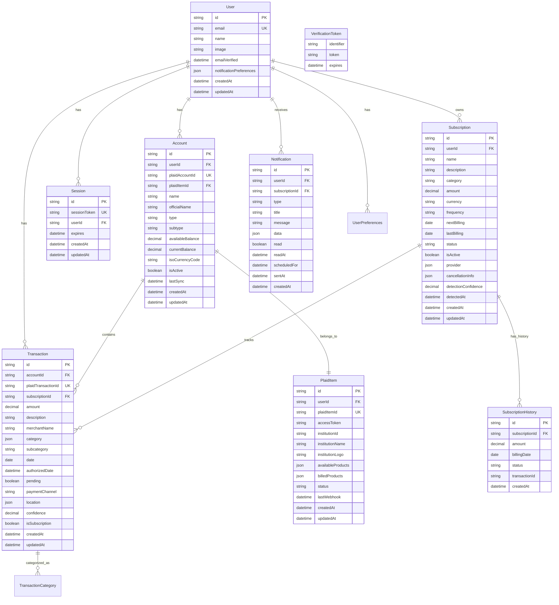

# 🗄️ SubPilot Database Design

## Overview

SubPilot uses **PostgreSQL** as the primary database with **Prisma ORM** for type-safe database operations. The schema is designed for scalability, performance, and data integrity.

## Database Schema



## Prisma Schema

### Core Models

```prisma
// User Management
model User {
  id            String    @id @default(cuid())
  email         String    @unique
  emailVerified DateTime?
  name          String?
  image         String?

  // Notification preferences stored as JSON
  notificationPreferences Json @default("{\"emailAlerts\":true,\"pushNotifications\":true,\"weeklyReports\":true}")

  // Timestamps
  createdAt DateTime @default(now())
  updatedAt DateTime @updatedAt

  // Relations
  accounts      Account[]
  sessions      Session[]
  plaidItems    PlaidItem[]
  subscriptions Subscription[]
  transactions  Transaction[]
  notifications Notification[]

  @@map("users")
}

// Bank Account Information
model Account {
  id                String  @id @default(cuid())
  userId            String
  plaidAccountId    String  @unique
  plaidItemId       String

  // Account Details
  name              String
  officialName      String?
  type              String  // depository, credit, loan, investment
  subtype           String  // checking, savings, credit card, etc.

  // Balance Information
  availableBalance  Decimal?
  currentBalance    Decimal
  isoCurrencyCode   String  @default("USD")

  // Status
  isActive          Boolean @default(true)
  lastSync          DateTime @default(now())

  // Timestamps
  createdAt         DateTime @default(now())
  updatedAt         DateTime @updatedAt

  // Relations
  user              User @relation(fields: [userId], references: [id], onDelete: Cascade)
  plaidItem         PlaidItem @relation(fields: [plaidItemId], references: [id], onDelete: Cascade)
  transactions      Transaction[]

  @@index([userId])
  @@index([plaidAccountId])
  @@map("accounts")
}

// Plaid Item (Bank Connection)
model PlaidItem {
  id                String   @id @default(cuid())
  userId            String
  plaidItemId       String   @unique
  accessToken       String   // Encrypted in application layer

  // Institution Information
  institutionId     String
  institutionName   String
  institutionLogo   String?

  // Plaid Product Information
  availableProducts Json     @default("[]")
  billedProducts    Json     @default("[]")

  // Connection Status
  status            String   @default("good") // good, bad, requires_update
  lastWebhook       DateTime?

  // Timestamps
  createdAt         DateTime @default(now())
  updatedAt         DateTime @updatedAt

  // Relations
  user              User @relation(fields: [userId], references: [id], onDelete: Cascade)
  accounts          Account[]

  @@index([userId])
  @@index([plaidItemId])
  @@map("plaid_items")
}

// Financial Transactions
model Transaction {
  id                    String   @id @default(cuid())
  accountId             String
  plaidTransactionId    String   @unique
  subscriptionId        String?

  // Transaction Details
  amount                Decimal
  description           String
  merchantName          String?
  category              Json     @default("[]") // Plaid categories array
  subcategory           String?

  // Dates
  date                  DateTime
  authorizedDate        DateTime?
  pending               Boolean  @default(false)

  // Additional Information
  paymentChannel        String?  // online, in store, etc.
  location              Json?    // Geographic data

  // Subscription Detection
  confidence            Decimal  @default(0) // 0-1 confidence score
  isSubscription        Boolean  @default(false)

  // Timestamps
  createdAt             DateTime @default(now())
  updatedAt             DateTime @updatedAt

  // Relations
  account               Account @relation(fields: [accountId], references: [id], onDelete: Cascade)
  subscription          Subscription? @relation(fields: [subscriptionId], references: [id])

  @@index([accountId])
  @@index([date])
  @@index([isSubscription])
  @@index([plaidTransactionId])
  @@map("transactions")
}

// Subscription Management
model Subscription {
  id                    String   @id @default(cuid())
  userId                String

  // Subscription Details
  name                  String
  description           String?
  category              String
  amount                Decimal
  currency              String   @default("USD")
  frequency             String   // monthly, yearly, weekly, quarterly

  // Billing Information
  nextBilling           DateTime?
  lastBilling           DateTime?

  // Status
  status                String   @default("active") // active, cancelled, paused
  isActive              Boolean  @default(true)

  // Provider Information (JSON)
  provider              Json     @default("{}")
  cancellationInfo       Json     @default("{}")

  // Detection Metadata
  detectionConfidence   Decimal  @default(0)
  detectedAt            DateTime @default(now())

  // Timestamps
  createdAt             DateTime @default(now())
  updatedAt             DateTime @updatedAt

  // Relations
  user                  User @relation(fields: [userId], references: [id], onDelete: Cascade)
  transactions          Transaction[]
  history               SubscriptionHistory[]
  notifications         Notification[]

  @@index([userId])
  @@index([status])
  @@index([nextBilling])
  @@map("subscriptions")
}

// Subscription Billing History
model SubscriptionHistory {
  id              String   @id @default(cuid())
  subscriptionId  String
  amount          Decimal
  billingDate     DateTime
  status          String   // charged, failed, refunded
  transactionId   String?

  // Timestamps
  createdAt       DateTime @default(now())

  // Relations
  subscription    Subscription @relation(fields: [subscriptionId], references: [id], onDelete: Cascade)

  @@index([subscriptionId])
  @@index([billingDate])
  @@map("subscription_history")
}

// Notification System
model Notification {
  id              String    @id @default(cuid())
  userId          String
  subscriptionId  String?

  // Notification Content
  type            String    // renewal_reminder, price_change, trial_ending, new_subscription
  title           String
  message         String
  data            Json      @default("{}")

  // Status
  read            Boolean   @default(false)
  readAt          DateTime?

  // Scheduling
  scheduledFor    DateTime
  sentAt          DateTime?

  // Timestamps
  createdAt       DateTime  @default(now())

  // Relations
  user            User @relation(fields: [userId], references: [id], onDelete: Cascade)
  subscription    Subscription? @relation(fields: [subscriptionId], references: [id])

  @@index([userId])
  @@index([read])
  @@index([scheduledFor])
  @@map("notifications")
}

// Authentication (Auth.js)
model Session {
  id           String   @id @default(cuid())
  sessionToken String   @unique
  userId       String
  expires      DateTime

  // Timestamps
  createdAt    DateTime @default(now())
  updatedAt    DateTime @updatedAt

  // Relations
  user         User @relation(fields: [userId], references: [id], onDelete: Cascade)

  @@map("sessions")
}

model VerificationToken {
  identifier String
  token      String   @unique
  expires    DateTime

  @@unique([identifier, token])
  @@map("verification_tokens")
}
```

## Indexes and Performance

### Primary Indexes

```sql
-- User lookups
CREATE INDEX idx_users_email ON users(email);

-- Account queries
CREATE INDEX idx_accounts_user_id ON accounts(user_id);
CREATE INDEX idx_accounts_plaid_account_id ON accounts(plaid_account_id);

-- Transaction queries (most performance critical)
CREATE INDEX idx_transactions_account_id ON transactions(account_id);
CREATE INDEX idx_transactions_date ON transactions(date);
CREATE INDEX idx_transactions_is_subscription ON transactions(is_subscription);
CREATE INDEX idx_transactions_user_date ON transactions(account_id, date DESC);

-- Subscription lookups
CREATE INDEX idx_subscriptions_user_id ON subscriptions(user_id);
CREATE INDEX idx_subscriptions_status ON subscriptions(status);
CREATE INDEX idx_subscriptions_next_billing ON subscriptions(next_billing);

-- Notification queries
CREATE INDEX idx_notifications_user_id ON notifications(user_id);
CREATE INDEX idx_notifications_unread ON notifications(user_id, read, scheduled_for);
```

### Composite Indexes

```sql
-- Dashboard queries
CREATE INDEX idx_user_active_subscriptions ON subscriptions(user_id, is_active, next_billing);

-- Transaction analysis
CREATE INDEX idx_transaction_analysis ON transactions(account_id, is_subscription, date DESC);

-- Notification scheduling
CREATE INDEX idx_notification_scheduling ON notifications(scheduled_for, sent_at) WHERE sent_at IS NULL;
```

## Data Migration Strategy

### Migration Files Structure

```ascii
prisma/migrations/
├── 001_init/
│   └── migration.sql
├── 002_add_subscription_confidence/
│   └── migration.sql
├── 003_add_notification_system/
│   └── migration.sql
└── 004_optimize_indexes/
    └── migration.sql
```

### Sample Migration

```sql
-- Migration: Add subscription detection confidence
-- Date: 2024-01-15

ALTER TABLE subscriptions
ADD COLUMN detection_confidence DECIMAL DEFAULT 0;

ALTER TABLE subscriptions
ADD COLUMN detected_at TIMESTAMP DEFAULT NOW();

-- Update existing records
UPDATE subscriptions
SET detection_confidence = 0.8, detected_at = created_at
WHERE detection_confidence IS NULL;

-- Add index for confidence-based queries
CREATE INDEX idx_subscriptions_confidence ON subscriptions(detection_confidence);
```

## Data Seeding

### Development Seed Data

```typescript
// prisma/seed.ts
import { PrismaClient } from '@prisma/client';

const prisma = new PrismaClient();

async function seed() {
  // Create test user
  const user = await prisma.user.create({
    data: {
      email: 'test@subpilot.dev',
      name: 'Test User',
      emailVerified: new Date(),
    },
  });

  // Create sample bank account
  const plaidItem = await prisma.plaidItem.create({
    data: {
      userId: user.id,
      plaidItemId: 'test_item_id',
      accessToken: 'encrypted_access_token',
      institutionId: 'ins_1',
      institutionName: 'First Platypus Bank',
    },
  });

  const account = await prisma.account.create({
    data: {
      userId: user.id,
      plaidAccountId: 'test_account_id',
      plaidItemId: plaidItem.id,
      name: 'Checking Account',
      type: 'depository',
      subtype: 'checking',
      currentBalance: 5000.00,
    },
  });

  // Create sample subscriptions
  const subscriptions = [
    {
      name: 'Netflix',
      category: 'streaming',
      amount: 15.99,
      frequency: 'monthly',
      nextBilling: new Date('2024-02-01'),
    },
    {
      name: 'Spotify Premium',
      category: 'music',
      amount: 9.99,
      frequency: 'monthly',
      nextBilling: new Date('2024-02-05'),
    },
    {
      name: 'Adobe Creative Cloud',
      category: 'software',
      amount: 52.99,
      frequency: 'monthly',
      nextBilling: new Date('2024-02-10'),
    },
  ];

  for (const sub of subscriptions) {
    await prisma.subscription.create({
      data: {
        ...sub,
        userId: user.id,
        detectionConfidence: 0.95,
      },
    });
  }
}

seed()
  .catch(console.error)
  .finally(() => prisma.$disconnect());
```

## Query Patterns

### Common Queries

```typescript
// Get user's active subscriptions
const activeSubscriptions = await prisma.subscription.findMany({
  where: {
    userId,
    isActive: true,
  },
  include: {
    transactions: {
      take: 5,
      orderBy: { date: 'desc' },
    },
  },
  orderBy: { nextBilling: 'asc' },
});

// Get monthly spending summary
const monthlySpending = await prisma.transaction.groupBy({
  by: ['accountId'],
  where: {
    account: { userId },
    date: {
      gte: startOfMonth,
      lte: endOfMonth,
    },
    isSubscription: true,
  },
  _sum: { amount: true },
  _count: true,
});

// Get upcoming renewals
const upcomingRenewals = await prisma.subscription.findMany({
  where: {
    userId,
    isActive: true,
    nextBilling: {
      gte: new Date(),
      lte: addDays(new Date(), 7),
    },
  },
  orderBy: { nextBilling: 'asc' },
});
```

### Optimized Dashboard Query

```typescript
// Single query for dashboard data
const dashboardData = await prisma.user.findUnique({
  where: { id: userId },
  include: {
    subscriptions: {
      where: { isActive: true },
      include: {
        transactions: {
          take: 1,
          orderBy: { date: 'desc' },
        },
      },
    },
    accounts: {
      where: { isActive: true },
      include: {
        _count: {
          select: { transactions: true },
        },
      },
    },
    notifications: {
      where: { read: false },
      take: 5,
      orderBy: { scheduledFor: 'desc' },
    },
  },
});
```

## Data Backup and Recovery

### Backup Strategy

```bash
# Daily automated backup
pg_dump -h localhost -U subpilot -d subpilot_prod > backup_$(date +%Y%m%d).sql

# Weekly full backup with compression
pg_dump -h localhost -U subpilot -d subpilot_prod | gzip > weekly_backup_$(date +%Y%m%d).sql.gz
```

### Point-in-Time Recovery

```sql
-- Create point-in-time recovery point
SELECT pg_create_restore_point('before_migration_004');

-- Restore to specific point if needed
-- (Requires WAL archiving setup)
```

## Security Considerations

### Data Encryption

- **At Rest**: PostgreSQL transparent data encryption
- **In Transit**: SSL/TLS connections required
- **Sensitive Fields**: Access tokens encrypted at application layer
- **PII**: Email and name fields considered sensitive

### Access Control

```sql
-- Database user permissions
CREATE ROLE subpilot_app;
GRANT SELECT, INSERT, UPDATE, DELETE ON ALL TABLES IN SCHEMA public TO subpilot_app;
GRANT USAGE, SELECT ON ALL SEQUENCES IN SCHEMA public TO subpilot_app;

-- Read-only analytics user
CREATE ROLE subpilot_analytics;
GRANT SELECT ON subscriptions, transactions, users TO subpilot_analytics;
```

### Data Retention

- **Transactions**: Keep for 7 years (financial compliance)
- **Subscriptions**: Keep indefinitely (user history)
- **Notifications**: Archive after 90 days
- **Sessions**: Expire after 30 days of inactivity
- **Deleted Users**: Soft delete with 30-day recovery period

## Performance Monitoring

### Query Performance

```sql
-- Monitor slow queries
SELECT query, mean_time, calls, total_time
FROM pg_stat_statements
WHERE mean_time > 100
ORDER BY mean_time DESC
LIMIT 10;

-- Index usage statistics
SELECT schemaname, tablename, indexname, idx_scan, idx_tup_read, idx_tup_fetch
FROM pg_stat_user_indexes
ORDER BY idx_scan DESC;
```

### Connection Monitoring

```typescript
// Prisma connection pool monitoring
const metrics = await prisma.$metrics.json();
console.log('Active connections:', metrics.counters.find(c => c.key === 'prisma_client_queries_active')?.value);
```

This database design provides a solid foundation for SubPilot's core functionality while maintaining flexibility for future enhancements and ensuring optimal performance at scale.
