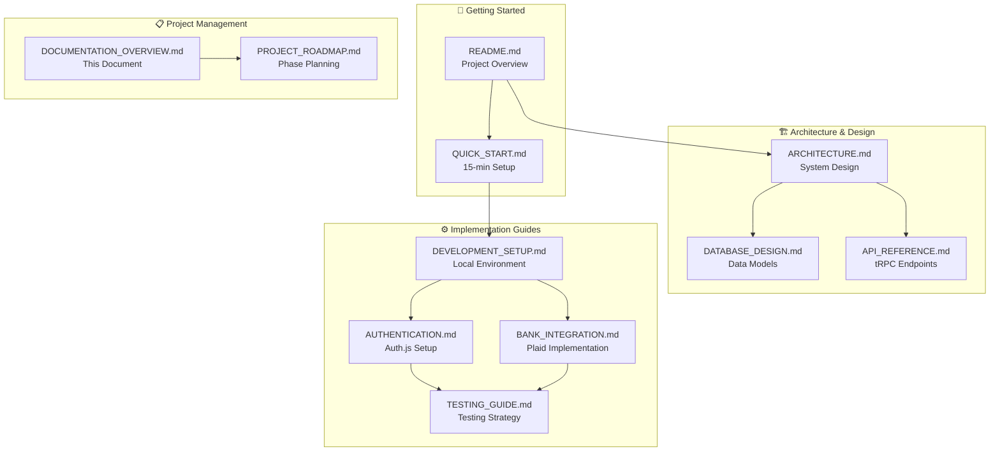
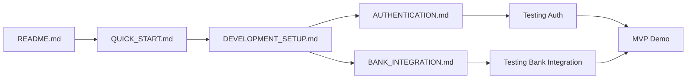

# 📚 SubPilot Documentation Overview

**Last Updated**: 2025-06-28 08:01 AM EDT  
**Version**: v1.3.0  
**Documentation Status**: Comprehensive and Up-to-Date (Phase 3 Complete)

## Introduction

This document provides a comprehensive overview of all SubPilot documentation, explaining how each piece connects to form a complete development and implementation guide for the subscription management platform.

## Documentation Structure

## Document Categories

### 1. Getting Started Documents

#### [`README.md`](./README.md) - Project Overview
**Purpose**: Primary entry point for the SubPilot project  
**Audience**: All stakeholders (developers, PMs, designers)  
**Key Content**:
- Project overview and mission
- Tech stack summary (T3 Stack)
- Quick start instructions
- Project structure
- Links to detailed documentation

**Connects to**: All other documentation as the central hub

#### [`QUICK_START.md`](./QUICK_START.md) - 15-Minute Setup
**Purpose**: Get developers running SubPilot in minimal time  
**Audience**: New developers joining the project  
**Key Content**:
- Prerequisites checklist
- Step-by-step setup (5 steps, 15 minutes)
- Common troubleshooting
- Test credentials for Plaid sandbox

**Connects to**: 
- [`DEVELOPMENT_SETUP.md`](./DEVELOPMENT_SETUP.md) for detailed setup
- [`AUTHENTICATION.md`](./AUTHENTICATION.md) for auth configuration
- [`BANK_INTEGRATION.md`](./BANK_INTEGRATION.md) for Plaid setup

### 2. Architecture & Design Documents

#### [`ARCHITECTURE.md`](./ARCHITECTURE.md) - System Design
**Purpose**: Comprehensive system architecture overview  
**Audience**: Technical leads, architects, senior developers  
**Key Content**:
- T3 Stack integration patterns
- Component architecture diagrams
- Data flow sequences
- Security architecture
- Scalability considerations

**Connects to**:
- [`DATABASE_DESIGN.md`](./DATABASE_DESIGN.md) for data layer details
- [`API_REFERENCE.md`](./API_REFERENCE.md) for API specifications
- All implementation guides for technical details

#### [`DATABASE_DESIGN.md`](./DATABASE_DESIGN.md) - Data Models
**Purpose**: Complete database schema and data architecture  
**Audience**: Backend developers, data engineers  
**Key Content**:
- Prisma schema definitions
- Entity relationship diagrams
- Performance optimization strategies
- Migration patterns
- Security considerations

**Connects to**:
- [`ARCHITECTURE.md`](./ARCHITECTURE.md) for overall system context
- [`API_REFERENCE.md`](./API_REFERENCE.md) for data access patterns
- [`BANK_INTEGRATION.md`](./BANK_INTEGRATION.md) for transaction models

#### [`API_REFERENCE.md`](./API_REFERENCE.md) - tRPC Endpoints
**Purpose**: Complete API documentation with type definitions  
**Audience**: Frontend developers, API consumers  
**Key Content**:
- All tRPC router endpoints
- Input/output schemas
- Authentication requirements
- Error handling patterns
- Usage examples

**Connects to**:
- [`ARCHITECTURE.md`](./ARCHITECTURE.md) for API layer context
- [`DATABASE_DESIGN.md`](./DATABASE_DESIGN.md) for data models
- [`AUTHENTICATION.md`](./AUTHENTICATION.md) for auth patterns

### 3. Implementation Guides

#### [`DEVELOPMENT_SETUP.md`](./DEVELOPMENT_SETUP.md) - Local Environment
**Purpose**: Comprehensive development environment configuration  
**Audience**: All developers  
**Key Content**:
- Complete dependency installation
- Environment variable configuration
- Database setup and seeding
- Development workflow and tools
- VS Code configuration

**Connects to**:
- [`QUICK_START.md`](./QUICK_START.md) for streamlined setup
- [`AUTHENTICATION.md`](./AUTHENTICATION.md) for auth setup
- [`BANK_INTEGRATION.md`](./BANK_INTEGRATION.md) for Plaid configuration
- [`TESTING_GUIDE.md`](./TESTING_GUIDE.md) for test environment

#### [`AUTHENTICATION.md`](./AUTHENTICATION.md) - Auth.js Setup
**Purpose**: Complete authentication implementation guide  
**Audience**: Full-stack developers  
**Key Content**:
- Auth.js configuration with multiple providers
- OAuth setup (Google, GitHub)
- Magic link email authentication
- Session management and security
- UI components and flows

**Connects to**:
- [`DEVELOPMENT_SETUP.md`](./DEVELOPMENT_SETUP.md) for environment setup
- [`API_REFERENCE.md`](./API_REFERENCE.md) for auth endpoints
- [`TESTING_GUIDE.md`](./TESTING_GUIDE.md) for auth testing

#### [`BANK_INTEGRATION.md`](./BANK_INTEGRATION.md) - Plaid Implementation
**Purpose**: Complete financial data integration guide  
**Audience**: Backend developers, fintech specialists  
**Key Content**:
- Plaid API integration patterns
- Transaction synchronization
- Real-time webhook handling
- Security and encryption
- Error handling and monitoring

**Connects to**:
- [`DEVELOPMENT_SETUP.md`](./DEVELOPMENT_SETUP.md) for Plaid configuration
- [`DATABASE_DESIGN.md`](./DATABASE_DESIGN.md) for financial data models
- [`API_REFERENCE.md`](./API_REFERENCE.md) for Plaid endpoints
- [`TESTING_GUIDE.md`](./TESTING_GUIDE.md) for integration testing

#### [`TESTING_GUIDE.md`](./TESTING_GUIDE.md) - Testing Strategy
**Purpose**: Comprehensive testing methodology and implementation  
**Audience**: All developers, QA engineers  
**Key Content**:
- Testing pyramid (unit, integration, e2e)
- Vitest and Playwright setup
- Mock strategies and test data
- CI/CD integration
- Performance testing

**Connects to**:
- All implementation guides for testing specific features
- [`DEVELOPMENT_SETUP.md`](./DEVELOPMENT_SETUP.md) for test environment
- [`PROJECT_ROADMAP.md`](./PROJECT_ROADMAP.md) for testing phases

### 4. Project Management Documents

#### [`DOCUMENTATION_OVERVIEW.md`](./DOCUMENTATION_OVERVIEW.md) - This Document
**Purpose**: Meta-documentation explaining the documentation structure  
**Audience**: All team members, especially new joiners  
**Key Content**:
- Documentation map and relationships
- Usage scenarios and workflows
- Maintenance guidelines

#### [`PROJECT_ROADMAP.md`](./PROJECT_ROADMAP.md) - Phase Planning
**Purpose**: Maps documentation to development phases and milestones  
**Audience**: Project managers, team leads, stakeholders  
**Key Content**:
- Phase-by-phase development plan
- Documentation-to-implementation mapping
- Milestone tracking and dependencies

## Usage Scenarios

### 🆕 New Developer Onboarding

**Recommended Reading Order**:
1. [`README.md`](./README.md) - Get project overview
2. [`QUICK_START.md`](./QUICK_START.md) - Set up local environment (15 min)
3. [`ARCHITECTURE.md`](./ARCHITECTURE.md) - Understand system design
4. [`DEVELOPMENT_SETUP.md`](./DEVELOPMENT_SETUP.md) - Complete development setup
5. [`API_REFERENCE.md`](./API_REFERENCE.md) - Learn API patterns
6. Choose specific implementation guides based on assigned features

### 🏗️ System Architecture Review

**Recommended Reading Order**:
1. [`ARCHITECTURE.md`](./ARCHITECTURE.md) - Overall system design
2. [`DATABASE_DESIGN.md`](./DATABASE_DESIGN.md) - Data architecture
3. [`API_REFERENCE.md`](./API_REFERENCE.md) - API design patterns
4. [`AUTHENTICATION.md`](./AUTHENTICATION.md) - Security architecture
5. [`BANK_INTEGRATION.md`](./BANK_INTEGRATION.md) - Financial data architecture

### 🚀 Feature Implementation

**Phase 1 MVP Features**:
1. **Authentication**: [`AUTHENTICATION.md`](./AUTHENTICATION.md) + [`API_REFERENCE.md`](./API_REFERENCE.md#auth-router)
2. **Bank Integration**: [`BANK_INTEGRATION.md`](./BANK_INTEGRATION.md) + [`DATABASE_DESIGN.md`](./DATABASE_DESIGN.md)
3. **Dashboard**: [`API_REFERENCE.md`](./API_REFERENCE.md) + [`ARCHITECTURE.md`](./ARCHITECTURE.md)
4. **Testing**: [`TESTING_GUIDE.md`](./TESTING_GUIDE.md) for all features

### 🐛 Troubleshooting

**Common Issues**:
1. **Setup Problems**: [`QUICK_START.md`](./QUICK_START.md#common-issues) + [`DEVELOPMENT_SETUP.md`](./DEVELOPMENT_SETUP.md#troubleshooting)
2. **Auth Issues**: [`AUTHENTICATION.md`](./AUTHENTICATION.md#troubleshooting)
3. **Bank Integration**: [`BANK_INTEGRATION.md`](./BANK_INTEGRATION.md#error-handling)
4. **Database Issues**: [`DATABASE_DESIGN.md`](./DATABASE_DESIGN.md#query-patterns)

### 📊 Performance Optimization

**Performance Documentation**:
1. [`ARCHITECTURE.md`](./ARCHITECTURE.md#performance-optimizations) - System-level optimizations
2. [`DATABASE_DESIGN.md`](./DATABASE_DESIGN.md#indexes-and-performance) - Database performance
3. [`API_REFERENCE.md`](./API_REFERENCE.md#rate-limiting) - API performance
4. [`TESTING_GUIDE.md`](./TESTING_GUIDE.md#performance-testing) - Performance testing

## Documentation Dependencies

### Phase 1 Dependencies

### Cross-Document References

| Document | References | Referenced By |
|----------|------------|---------------|
| [`README.md`](./README.md) | All docs | All docs |
| [`ARCHITECTURE.md`](./ARCHITECTURE.md) | Database, API, Auth, Bank | All implementation guides |
| [`DATABASE_DESIGN.md`](./DATABASE_DESIGN.md) | Architecture | API, Bank Integration |
| [`API_REFERENCE.md`](./API_REFERENCE.md) | Architecture, Database | All implementation guides |
| [`AUTHENTICATION.md`](./AUTHENTICATION.md) | Development Setup, API | Testing |
| [`BANK_INTEGRATION.md`](./BANK_INTEGRATION.md) | Development Setup, Database, API | Testing |

## Maintenance Guidelines

### Document Update Triggers

1. **Architecture Changes** → Update [`ARCHITECTURE.md`](./ARCHITECTURE.md), [`DATABASE_DESIGN.md`](./DATABASE_DESIGN.md), [`API_REFERENCE.md`](./API_REFERENCE.md)
2. **New Features** → Update [`API_REFERENCE.md`](./API_REFERENCE.md), add implementation guides
3. **Setup Changes** → Update [`DEVELOPMENT_SETUP.md`](./DEVELOPMENT_SETUP.md), [`QUICK_START.md`](./QUICK_START.md)
4. **Testing Strategy Changes** → Update [`TESTING_GUIDE.md`](./TESTING_GUIDE.md)

### Documentation Review Process

1. **Weekly Reviews**: Check for outdated information
2. **Feature Branch Updates**: Update docs alongside code changes
3. **Release Updates**: Sync docs with deployment changes
4. **Quarterly Audits**: Comprehensive documentation review

### Quality Standards

- **Accuracy**: All code examples must be tested and working
- **Completeness**: Each document should be self-contained for its purpose
- **Clarity**: Use diagrams, examples, and clear step-by-step instructions
- **Navigation**: Clear cross-references and logical flow
- **Currency**: Regular updates to match current implementation

## Future Documentation

### Phase 2 Additions (Complete)
- **AI_CATEGORIZATION.md** - OpenAI categorization implementation ✅
- **ANALYTICS_FEATURES.md** - Reporting and insights development ✅
- **UI_COMPONENTS.md** - Responsive design patterns and theme system ✅

### Phase 3 Additions (Complete)
- **PHASE-3-CANCELLATION-IMPLEMENTATION.md** - Cancellation automation ✅
- **AI_ASSISTANT_IMPLEMENTATION.md** - GPT-4 powered assistant ✅
- **PHASE-3-PREMIUM-FEATURES-COMPLETE.md** - Stripe billing integration ✅
- **PHASE-3-COMPLETE.md** - Full automation system overview ✅

### Phase 4 Additions
- **MARKETING_INTEGRATION.md** - Analytics and SEO
- **DEPLOYMENT_GUIDE.md** - Production deployment
- **MONITORING_GUIDE.md** - Observability and alerting

## Recent Documentation Updates (2025-06-26)

### New Documentation
- **[`UI_COMPONENTS.md`](./UI_COMPONENTS.md)** - Comprehensive UI component guide with theme system documentation
- **[`SESSION-SUMMARY-2025-06-26-UI-FIXES.md`](./SESSION-SUMMARY-2025-06-26-UI-FIXES.md)** - Latest UI fixes and improvements

### Updated Documentation
- **Theme System Fixes** documented across multiple files
- **Analytics Calendar Improvements** added to relevant guides
- **UI Polish Updates** reflected in component documentation

---

This documentation overview ensures all team members can navigate the SubPilot documentation effectively and understand how each piece contributes to the overall development and implementation process.