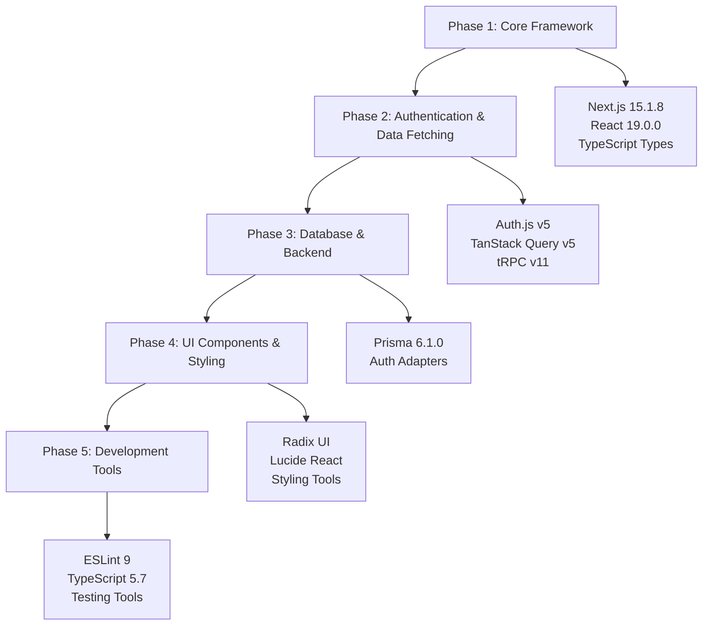

# 📦 SubPilot Package Update Plan

## 🎯 Overview

This document outlines the comprehensive plan to update all packages in the SubPilot application to their latest compatible versions. The strategy prioritizes updating major frameworks (Next.js, React) first, then updating other packages to match their compatibility requirements.

### Current State

- **Next.js**: 14.0.3 → **Target**: 15.1.8
- **React**: 18.2.0 → **Target**: 19.0.0
- **Total Dependencies**: 88 packages to update
- **Strategy**: 5-phase implementation with testing between phases

## 🚀 Migration Strategy



## 📦 Phase 1: Core Framework Updates (CRITICAL)

### Priority: **HIGHEST** - Must be completed first

**Core React & Next.js:**

```json
{
  "next": "^15.1.8",
  "react": "^19.0.0", 
  "react-dom": "^19.0.0",
  "@types/react": "^19.0.0",
  "@types/react-dom": "^19.0.0",
  "eslint-config-next": "^15.1.8"
}
```

### 🚨 Breaking Changes to Address

1. **Font Import Migration**

   ```javascript
   // REMOVE (deprecated)
   import { Inter } from '@next/font/google'
   
   // REPLACE WITH
   import { Inter } from 'next/font/google'
   ```

2. **React 19 Hook Updates**

   ```javascript
   // BEFORE (will cause errors)
   const ref = useRef()
   const context = createContext()
   
   // AFTER (required in React 19)
   const ref = useRef(null)
   const context = createContext(null)
   ```

### Installation Commands

```bash
# Remove deprecated package
npm uninstall @next/font

# Install core updates
npm install next@^15.1.8 react@^19.0.0 react-dom@^19.0.0
npm install -D @types/react@^19.0.0 @types/react-dom@^19.0.0 eslint-config-next@^15.1.8
```

### Testing Checklist

- [ ] `npm run build` succeeds
- [ ] `npm run dev` starts without errors
- [ ] `npm run type-check` passes
- [ ] Basic pages load correctly

---

## 📦 Phase 2: Authentication & Data Fetching (HIGH PRIORITY)

### Priority: **HIGH** - Critical for app functionality

**Authentication (NextAuth → Auth.js v5):**

```json
{
  "next-auth": "^5.0.0-beta.25",
  "@auth/prisma-adapter": "^2.7.2"
}
```

**Data Fetching:**

```json
{
  "@tanstack/react-query": "^5.62.7",
  "@trpc/client": "^11.0.0-rc.673",
  "@trpc/next": "^11.0.0-rc.673", 
  "@trpc/react-query": "^11.0.0-rc.673",
  "@trpc/server": "^11.0.0-rc.673"
}
```

### 🚨 Major Breaking Changes

1. **NextAuth v4 → Auth.js v5 Configuration**
   - Configuration file structure changes
   - Provider setup changes
   - Session handling updates

2. **TanStack Query v4 → v5**
   - `useQuery` hook syntax changes
   - Query key structure updates
   - Cache configuration changes

3. **tRPC v10 → v11**
   - Client setup modifications
   - Type generation updates

### Installation Commands

```bash
npm install next-auth@^5.0.0-beta.25 @auth/prisma-adapter@^2.7.2
npm install @tanstack/react-query@^5.62.7
npm install @trpc/client@^11.0.0-rc.673 @trpc/next@^11.0.0-rc.673 @trpc/react-query@^11.0.0-rc.673 @trpc/server@^11.0.0-rc.673
```

### Testing Checklist

- [ ] Authentication flow works
- [ ] Database queries execute
- [ ] tRPC endpoints respond
- [ ] Session management works

---

## 📦 Phase 3: Database & Backend (MEDIUM PRIORITY)

### Priority: **MEDIUM** - Important for data layer

**Database:**

```json
{
  "@prisma/client": "^6.1.0",
  "prisma": "^6.1.0"
}
```

**Other Backend Dependencies:**

```json
{
  "@t3-oss/env-nextjs": "^0.11.1",
  "superjson": "^2.2.1",
  "zod": "^3.24.1"
}
```

### Installation Commands

```bash
npm install @prisma/client@^6.1.0 prisma@^6.1.0
npm install @t3-oss/env-nextjs@^0.11.1 superjson@^2.2.1 zod@^3.24.1
```

### Testing Checklist

- [ ] Database migrations work
- [ ] Prisma client generates successfully
- [ ] Environment validation works
- [ ] API routes function correctly

---

## 📦 Phase 4: UI Components & Styling (MEDIUM PRIORITY)

### Priority: **MEDIUM** - Visual and interaction layer

**Radix UI Components (React 19 Compatible):**

```json
{
  "@radix-ui/react-accordion": "^1.2.2",
  "@radix-ui/react-alert-dialog": "^1.1.4",
  "@radix-ui/react-avatar": "^1.1.2",
  "@radix-ui/react-badge": "^1.1.2",
  "@radix-ui/react-button": "^1.1.2",
  "@radix-ui/react-calendar": "^1.1.2",
  "@radix-ui/react-card": "^1.1.2",
  "@radix-ui/react-checkbox": "^1.1.4",
  "@radix-ui/react-dialog": "^1.1.4",
  "@radix-ui/react-dropdown-menu": "^2.1.4",
  "@radix-ui/react-form": "^0.1.2",
  "@radix-ui/react-icons": "^1.3.2",
  "@radix-ui/react-input": "^1.1.2",
  "@radix-ui/react-label": "^2.1.2",
  "@radix-ui/react-popover": "^1.1.4",
  "@radix-ui/react-progress": "^1.1.2",
  "@radix-ui/react-select": "^2.1.4",
  "@radix-ui/react-separator": "^1.1.2",
  "@radix-ui/react-sheet": "^1.1.2",
  "@radix-ui/react-slot": "^1.1.2",
  "@radix-ui/react-switch": "^1.1.2",
  "@radix-ui/react-table": "^1.1.2",
  "@radix-ui/react-tabs": "^1.1.4",
  "@radix-ui/react-toast": "^1.2.4",
  "@radix-ui/react-toggle": "^1.1.2",
  "@radix-ui/react-tooltip": "^1.1.4"
}
```

**Icons & Styling:**

```json
{
  "lucide-react": "^0.468.0",
  "class-variance-authority": "^0.7.1",
  "tailwind-merge": "^2.7.0",
  "tailwindcss-animate": "^1.0.7",
  "clsx": "^2.1.1",
  "cmdk": "^1.0.4"
}
```

**Form & UI Utilities:**

```json
{
  "react-hook-form": "^7.54.2",
  "@hookform/resolvers": "^3.10.0",
  "react-day-picker": "^9.4.3",
  "date-fns": "^4.1.0"
}
```

### Installation Commands

```bash
# Radix UI Components (batch install)
npm install @radix-ui/react-accordion@^1.2.2 @radix-ui/react-alert-dialog@^1.1.4 @radix-ui/react-avatar@^1.1.2 @radix-ui/react-badge@^1.1.2 @radix-ui/react-button@^1.1.2 @radix-ui/react-calendar@^1.1.2 @radix-ui/react-card@^1.1.2 @radix-ui/react-checkbox@^1.1.4 @radix-ui/react-dialog@^1.1.4 @radix-ui/react-dropdown-menu@^2.1.4 @radix-ui/react-form@^0.1.2 @radix-ui/react-icons@^1.3.2 @radix-ui/react-input@^1.1.2 @radix-ui/react-label@^2.1.2 @radix-ui/react-popover@^1.1.4 @radix-ui/react-progress@^1.1.2 @radix-ui/react-select@^2.1.4 @radix-ui/react-separator@^1.1.2 @radix-ui/react-sheet@^1.1.2 @radix-ui/react-slot@^1.1.2 @radix-ui/react-switch@^1.1.2 @radix-ui/react-table@^1.1.2 @radix-ui/react-tabs@^1.1.4 @radix-ui/react-toast@^1.2.4 @radix-ui/react-toggle@^1.1.2 @radix-ui/react-tooltip@^1.1.4

# Icons & Styling
npm install lucide-react@^0.468.0 class-variance-authority@^0.7.1 tailwind-merge@^2.7.0 clsx@^2.1.1 cmdk@^1.0.4

# Forms & UI Utilities
npm install react-hook-form@^7.54.2 @hookform/resolvers@^3.10.0 react-day-picker@^9.4.3 date-fns@^4.1.0
```

### Testing Checklist

- [ ] UI components render correctly
- [ ] Forms work properly
- [ ] Styling is intact
- [ ] Icons display correctly

---

## 📦 Phase 5: Development Tools (LOW PRIORITY)

### Priority: **LOW** - Development experience improvements

**TypeScript & ESLint:**

```json
{
  "typescript": "^5.7.3",
  "@typescript-eslint/eslint-plugin": "^8.21.0",
  "@typescript-eslint/parser": "^8.21.0", 
  "eslint": "^9.17.0"
}
```

**Testing:**

```json
{
  "vitest": "^2.1.8",
  "@vitest/ui": "^2.1.8",
  "@playwright/test": "^1.49.1",
  "@testing-library/react": "^16.1.0",
  "@testing-library/jest-dom": "^6.6.3",
  "@testing-library/user-event": "^14.5.2",
  "jsdom": "^25.0.1"
}
```

**Build Tools:**

```json
{
  "prettier": "^3.4.2",
  "prettier-plugin-tailwindcss": "^0.6.9",
  "autoprefixer": "^10.4.20",
  "postcss": "^8.5.1",
  "tailwindcss": "^3.4.17",
  "concurrently": "^9.1.0",
  "tsx": "^4.19.2"
}
```

**Additional Dependencies:**

```json
{
  "next-themes": "^0.4.4",
  "plaid": "^11.1.0",
  "react-plaid-link": "^3.6.0",
  "recharts": "^2.13.3"
}
```

### Installation Commands

```bash
# Development tools
npm install -D typescript@^5.7.3 @typescript-eslint/eslint-plugin@^8.21.0 @typescript-eslint/parser@^8.21.0 eslint@^9.17.0

# Testing tools
npm install -D vitest@^2.1.8 @vitest/ui@^2.1.8 @playwright/test@^1.49.1 @testing-library/react@^16.1.0 @testing-library/jest-dom@^6.6.3 @testing-library/user-event@^14.5.2 jsdom@^25.0.1

# Build tools
npm install -D prettier@^3.4.2 prettier-plugin-tailwindcss@^0.6.9 autoprefixer@^10.4.20 postcss@^8.5.1 tailwindcss@^3.4.17 concurrently@^9.1.0 tsx@^4.19.2

# Additional dependencies
npm install next-themes@^0.4.4 plaid@^11.1.0 react-plaid-link@^3.6.0 recharts@^2.13.3
```

### Testing Checklist

- [ ] Linting works correctly
- [ ] Tests run successfully
- [ ] Build process works
- [ ] Development tools function

---

## 🧪 Testing Strategy

### After Each Phase

1. ✅ **Build Test**: `npm run build`
2. ✅ **Development Server**: `npm run dev`
3. ✅ **Type Checking**: `npm run type-check`
4. ✅ **Linting**: `npm run lint`
5. ✅ **Unit Tests**: `npm run test`
6. ✅ **E2E Tests**: `npm run test:e2e`

### Comprehensive Testing

- [ ] Authentication flow
- [ ] Database operations
- [ ] Plaid integration
- [ ] UI component functionality
- [ ] API routes
- [ ] Environment variables

---

## ⚠️ Risk Assessment

### 🔴 High Risk (Requires Manual Code Changes)

- **NextAuth v4 → Auth.js v5**: Configuration structure changes
- **TanStack Query v4 → v5**: Hook API changes
- **tRPC v10 → v11**: Client setup modifications
- **Font imports**: `@next/font` → `next/font`

### 🟡 Medium Risk (May Require Updates)

- **Prisma v5 → v6**: Schema compatibility
- **ESLint v8 → v9**: Configuration format changes
- **Radix UI components**: Prop changes possible

### 🟢 Low Risk (Backward Compatible)

- **Utility libraries**: clsx, tailwind-merge, etc.
- **Icons**: lucide-react
- **Development tools**: prettier, autoprefixer

---

## 📋 Implementation Checklist

### Pre-Implementation

- [ ] Create backup branch
- [ ] Document current working state
- [ ] Clear node_modules and package-lock.json
- [ ] Ensure database is backed up

### Phase Implementation

- [ ] Phase 1: Core Framework ✅
- [ ] Phase 2: Authentication & Data ✅
- [ ] Phase 3: Database & Backend ✅
- [ ] Phase 4: UI Components ✅
- [ ] Phase 5: Development Tools ✅

### Post-Implementation

- [ ] Full application testing
- [ ] Performance validation
- [ ] Security audit
- [ ] Documentation updates

---

## 🔄 Rollback Plan

If critical issues arise:

1. **Immediate**: Revert to backup branch
2. **Package-specific**: Downgrade problematic packages
3. **Phase-specific**: Complete current phase, hold next phases
4. **Code fixes**: Address breaking changes incrementally

---

## 📚 Additional Resources

- [Next.js 15 Migration Guide](https://nextjs.org/docs/upgrading)
- [React 19 Upgrade Guide](https://react.dev/blog/2024/04/25/react-19-upgrade-guide)
- [Auth.js v5 Migration](https://authjs.dev/guides/upgrade-to-v5)
- [TanStack Query v5 Migration](https://tanstack.com/query/v5/docs/react/guides/migrating-to-v5)
- [tRPC v11 Migration](https://trpc.io/docs/migrate-from-v10-to-v11)

---

**Created**: 2025-06-19  
**Status**: Ready for Implementation  
**Estimated Time**: 4-6 hours with testing
