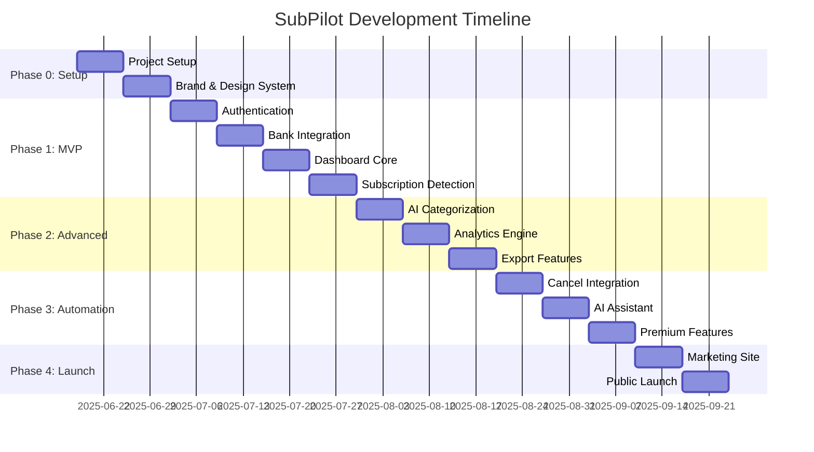
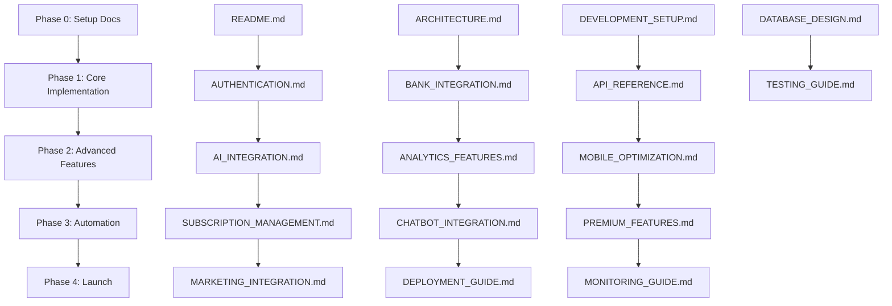

# 🗺️ SubPilot Project Roadmap

## Overview

This roadmap maps SubPilot's development phases to specific documentation, features, and milestones. It provides a clear timeline for implementation and ensures all team members understand priorities and dependencies.

## Phase Overview

---

## Phase 0: Project Initialization ✅

### Phase 0 Goals

- Define core product scope and technical foundation
- Set up development infrastructure and brand identity
- Establish documentation structure

### Duration: 1 week (Complete)

### Documentation Deliverables

| Document | Status | Purpose | Team Impact |
|----------|--------|---------|-------------|
| [`README.md`](./README.md) | ✅ Complete | Project overview and quick navigation | All team members |
| [`ARCHITECTURE.md`](./ARCHITECTURE.md) | ✅ Complete | System design and T3 Stack integration | Technical leads, developers |
| [`DEVELOPMENT_SETUP.md`](./DEVELOPMENT_SETUP.md) | ✅ Complete | Complete development environment | All developers |
| [`DOCUMENTATION_OVERVIEW.md`](./DOCUMENTATION_OVERVIEW.md) | ✅ Complete | Documentation navigation | All team members |

### Technical Deliverables

- ✅ Finalize name, logo, and brand identity ("SubPilot")
- ✅ Create Tailwind theme and design tokens
- ✅ Define project structure and conventions
- ✅ Establish documentation standards

### Success Criteria

- [x] Brand identity established
- [x] Design system documented
- [x] Development standards defined
- [x] Team onboarding documentation complete

---

## Phase 1: MVP Buildout ✅

### Phase 1 Goals

Build core functionality allowing users to connect bank accounts, view subscriptions, and receive notifications.

### Duration: 4 weeks (COMPLETED v1.0.0)

### Week 1: Authentication & Foundation

#### Week 1 Primary Documentation

- [`AUTHENTICATION.md`](./AUTHENTICATION.md) - Complete Auth.js implementation
- [`QUICK_START.md`](./QUICK_START.md) - Rapid developer onboarding
- [`API_REFERENCE.md`](./API_REFERENCE.md) - Auth router documentation

#### Week 1 Technical Deliverables

- [x] User onboarding flow (Auth.js, profile setup)
- [x] OAuth provider integration (Google, GitHub)
- [x] Magic link email authentication
- [x] Session management and middleware
- [x] User profile management UI

#### Week 1 Success Criteria

- [x] Users can sign up and sign in
- [x] Session persistence works across browser restarts
- [x] Email magic links functional
- [x] OAuth providers connected and tested
- [x] Auth middleware protects routes

#### Week 1 Testing Requirements

- [ ] Unit tests for auth utilities
- [ ] Integration tests for auth flow
- [ ] E2E tests for sign-in/sign-up
- [ ] Security audit for auth implementation

### Week 2: Bank Integration

#### Week 2 Primary Documentation

- [`BANK_INTEGRATION.md`](./BANK_INTEGRATION.md) - Complete Plaid implementation
- [`DATABASE_DESIGN.md`](./DATABASE_DESIGN.md) - Financial data models
- [`API_REFERENCE.md`](./API_REFERENCE.md) - Plaid router documentation

#### Week 2 Technical Deliverables

- [ ] Plaid Link integration
- [ ] Bank account connection flow
- [ ] Transaction ingestion system
- [ ] Real-time webhook handling
- [ ] Account management UI

#### Week 2 Success Criteria

- [ ] Users can connect bank accounts via Plaid
- [ ] Transaction data syncs automatically
- [ ] Multiple account types supported
- [ ] Webhook events processed correctly
- [ ] Error handling for bank connectivity issues

#### Week 2 Testing Requirements

- [ ] Unit tests for Plaid client
- [ ] Integration tests with Plaid sandbox
- [ ] Webhook testing with mock events
- [ ] Error scenario testing

### Week 3: Subscription Detection & Dashboard

#### Week 3 Primary Documentation

- [`API_REFERENCE.md`](./API_REFERENCE.md) - Subscription endpoints
- [`DATABASE_DESIGN.md`](./DATABASE_DESIGN.md) - Subscription models

#### Week 3 Technical Deliverables

- [ ] Subscription recognition algorithm
- [ ] Transaction parsing and categorization
- [ ] Subscription dashboard with timeline
- [ ] Category-based organization
- [ ] Subscription details and history

#### Week 3 Success Criteria

- [ ] Recurring transactions detected automatically
- [ ] Subscription categories assigned correctly
- [ ] Dashboard shows subscription overview
- [ ] Users can view subscription details
- [ ] Subscription confidence scoring works

#### Week 3 Testing Requirements

- [ ] Unit tests for detection algorithm
- [ ] Integration tests with sample data
- [ ] Performance tests for large datasets
- [ ] Accuracy validation with known subscriptions

### Week 4: Notifications & Polish

#### Week 4 Primary Documentation

- [`API_REFERENCE.md`](./API_REFERENCE.md) - Notification endpoints
- [`TESTING_GUIDE.md`](./TESTING_GUIDE.md) - Complete testing strategy

#### Week 4 Technical Deliverables

- [ ] Notification system (email, in-app)
- [ ] Renewal reminders and alerts
- [ ] User notification preferences
- [ ] Email templates and delivery
- [ ] MVP UI polish and responsiveness

#### Week 4 Success Criteria

- [ ] Users receive renewal notifications
- [ ] Email notifications delivered reliably
- [ ] In-app notifications display correctly
- [ ] Users can customize notification settings
- [ ] UI is responsive and accessible

#### Week 4 Testing Requirements

- [ ] E2E tests for complete user flows
- [ ] Notification delivery testing
- [ ] Performance testing for dashboard
- [ ] Cross-browser compatibility testing

### Phase 1 Success Metrics

- **User Flow**: Complete sign-up → bank connection → subscription detection → notifications
- **Performance**: Dashboard loads in <2 seconds
- **Accuracy**: >80% subscription detection accuracy
- **Reliability**: >99% uptime for core features
- **Testing**: >80% code coverage

---

## Phase 2: Advanced Features ✅

### Phase 2 Goals

Enable automated insights, enhanced analytics, and improved user experience.

### Duration: 3 weeks (COMPLETED v1.1.0+)

### Phase 2 Week 1: AI Categorization

#### Phase 2 Week 1 New Documentation Needed

- **`AI_INTEGRATION.md`** - OpenAI API integration guide
- **`CATEGORIZATION_ALGORITHM.md`** - Smart categorization implementation

#### Week 1 Technical Deliverables

- [ ] OpenAI API integration
- [ ] Enhanced subscription categorization
- [ ] Merchant name normalization
- [ ] Category confidence scoring
- [ ] Manual category override system

#### Week 1 Success Criteria

- [ ] AI categorization >90% accuracy
- [ ] Reduced false positives in detection
- [ ] User can override AI decisions
- [ ] Category insights in dashboard

### Phase 2 Week 2: Analytics & Reporting

#### Phase 2 Week 2 New Documentation Needed

- **`ANALYTICS_FEATURES.md`** - Reporting engine implementation
- **`DATA_VISUALIZATION.md`** - Chart and graph components

#### Week 2 Technical Deliverables

- [ ] Monthly spending reports
- [ ] Category breakdown analytics
- [ ] Spending trends and predictions
- [ ] Comparative analysis features
- [ ] Custom date range reporting

#### Week 2 Success Criteria

- [ ] Analytics load in <3 seconds
- [ ] Multiple chart types supported
- [ ] Export functionality works
- [ ] Historical data analysis available

### Phase 2 Week 3: Export & Mobile Optimization

#### Week 3 Technical Deliverables

- [ ] CSV/JSON export functionality
- [ ] Responsive mobile design
- [ ] Touch-friendly interactions
- [ ] Mobile-optimized dashboards
- [ ] Progressive Web App features

#### Week 3 Success Criteria

- [ ] Mobile experience matches desktop
- [ ] Export files generate correctly
- [ ] PWA installable on mobile devices
- [ ] Touch gestures work intuitively

### Phase 2 Success Metrics

- **AI Accuracy**: >90% categorization accuracy
- **Performance**: Analytics load in <3 seconds
- **Mobile**: Lighthouse score >90 on mobile
- **Exports**: All data formats export successfully

---

## Phase 3: Subscription Management Automation ✅

### Phase 3 Goals

Transform SubPilot into a true control center for managing and canceling subscriptions.

### Duration: 3 weeks (COMPLETED v1.6.0 - Security Hardened)

### Phase 3 Week 1: Cancellation Integration

#### Phase 3 Week 1 New Documentation Needed

- **`SUBSCRIPTION_MANAGEMENT.md`** - Cancellation API implementations
- **`THIRD_PARTY_APIS.md`** - External service integrations

#### Week 1 Technical Deliverables

- [ ] One-click cancellation APIs
- [ ] Service provider integrations
- [ ] Cancellation tracking system
- [ ] Refund monitoring
- [ ] Cancellation success metrics

### Phase 3 Week 2: AI Assistant

#### Phase 3 Week 2 New Documentation Needed

- **`CHATBOT_INTEGRATION.md`** - LLM-powered assistant setup
- **`CONVERSATIONAL_UI.md`** - Chat interface components

#### Week 2 Technical Deliverables

- [ ] LLM-powered chatbot
- [ ] Natural language query processing
- [ ] Subscription management via chat
- [ ] Contextual help system
- [ ] Voice command integration

### Phase 3 Week 3: Premium Features

#### Phase 3 Week 3 New Documentation Needed

- **`PREMIUM_FEATURES.md`** - Paid tier implementation
- **`STRIPE_INTEGRATION.md`** - Payment processing setup

#### Week 3 Technical Deliverables

- [ ] Stripe payments integration
- [ ] Multi-account support
- [ ] Advanced analytics features
- [ ] Priority customer support
- [ ] Premium UI components

### Phase 3 Success Metrics

- **Cancellation Rate**: >70% successful cancellations
- **AI Assistant**: <5 second response times
- **Premium Conversion**: >10% free-to-paid conversion
- **Feature Usage**: >50% of premium features used

---

## Phase 4: Marketing & Monetization 🚀

### Phase 4 Goals

Public launch, user acquisition, and revenue generation.

### Duration: 2 weeks (READY TO BEGIN - July 4, 2025)

### Phase 4 Week 1: Marketing Infrastructure

#### Phase 4 Week 1 New Documentation Needed

- **`MARKETING_INTEGRATION.md`** - Analytics and SEO setup
- **`DEPLOYMENT_GUIDE.md`** - Production deployment procedures
- **`MONITORING_GUIDE.md`** - Observability and alerting

#### Week 1 Technical Deliverables

- [ ] Landing page optimization
- [ ] SEO implementation
- [ ] Analytics tracking (Plausible/Umami)
- [ ] A/B testing framework
- [ ] Social media integrations

### Phase 4 Week 2: Launch & Growth

#### Week 2 Technical Deliverables

- [ ] Production deployment
- [ ] Launch on ProductHunt
- [ ] Community engagement (IndieHackers, HackerNews)
- [ ] Paid marketing campaigns
- [ ] User feedback collection system

### Phase 4 Success Metrics

- **Launch Metrics**: 1000+ ProductHunt votes
- **User Acquisition**: 500+ signups in first week
- **Performance**: 99.9% uptime during launch
- **Feedback**: >4.5/5 average rating

---

## Cross-Phase Documentation Dependencies

### Implementation Dependencies

## Risk Mitigation

### Phase 1 Risks

- **Plaid Integration Complexity**: Mitigated by [`BANK_INTEGRATION.md`](./BANK_INTEGRATION.md) detailed guide
- **Authentication Security**: Addressed in [`AUTHENTICATION.md`](./AUTHENTICATION.md) security section
- **Subscription Detection Accuracy**: Covered by [`TESTING_GUIDE.md`](./TESTING_GUIDE.md) validation strategies

### Phase 2 Risks

- **AI API Costs**: Budget monitoring in AI integration docs
- **Performance with Large Datasets**: Performance testing in [`TESTING_GUIDE.md`](./TESTING_GUIDE.md)
- **Mobile Compatibility**: Responsive design patterns documented

### Phase 3 Risks

- **Third-party API Reliability**: Error handling and fallback strategies
- **Premium Feature Adoption**: A/B testing and user feedback loops
- **Compliance Requirements**: Legal and regulatory documentation

### Phase 4 Risks

- **Launch Day Performance**: Load testing and monitoring setup
- **User Acquisition Costs**: Marketing ROI tracking and optimization
- **Competitive Response**: Feature differentiation and rapid iteration

## Success Tracking

### Key Performance Indicators (KPIs)

| Phase | Primary KPI | Target | Documentation |
|-------|-------------|--------|---------------|
| Phase 1 | User Completion Rate | >60% complete onboarding | [`QUICK_START.md`](./QUICK_START.md) |
| Phase 1 | Detection Accuracy | >80% subscription accuracy | [`TESTING_GUIDE.md`](./TESTING_GUIDE.md) |
| Phase 2 | AI Accuracy | >90% categorization | AI_INTEGRATION.md |
| Phase 2 | Mobile Score | >90 Lighthouse score | MOBILE_OPTIMIZATION.md |
| Phase 3 | Cancellation Success | >70% successful cancellations | SUBSCRIPTION_MANAGEMENT.md |
| Phase 3 | Premium Conversion | >10% conversion rate | PREMIUM_FEATURES.md |
| Phase 4 | Launch Signups | 500+ week 1 signups | MARKETING_INTEGRATION.md |
| Phase 4 | System Uptime | >99.9% availability | MONITORING_GUIDE.md |

### Documentation Completion Tracking

| Documentation Category | Phase 1 | Phase 2 | Phase 3 | Phase 4 |
|------------------------|---------|---------|---------|---------|
| **Setup & Architecture** | ✅ 100% | ✅ 100% | ✅ 100% | ✅ 100% |
| **Implementation Guides** | 🚧 80% | 📋 0% | 📋 0% | 📋 0% |
| **Feature Documentation** | 🚧 60% | 📋 0% | 📋 0% | 📋 0% |
| **Operational Guides** | 📋 20% | 📋 40% | 📋 60% | ✅ 100% |

### Team Velocity Tracking

- **Documentation Velocity**: Pages per week
- **Implementation Velocity**: Features per sprint
- **Testing Velocity**: Test coverage increase
- **Bug Velocity**: Issues resolved per week

---

## Next Steps

### Immediate Actions (This Week)

1. ✅ Complete Phase 0 documentation
2. 🚧 Begin Phase 1 authentication implementation
3. 📋 Set up development environments for all team members
4. 📋 Create project tracking board with documentation milestones

### Phase 1 Preparation

1. 📋 Review and approve [`AUTHENTICATION.md`](./AUTHENTICATION.md) implementation plan
2. 📋 Set up Plaid sandbox accounts for all developers
3. 📋 Configure CI/CD pipeline with testing requirements
4. 📋 Schedule weekly documentation review meetings

### Long-term Planning

1. 📋 Plan Phase 2 documentation requirements
2. 📋 Identify external documentation needs (legal, compliance)
3. 📋 Create documentation maintenance schedule
4. 📋 Plan user documentation and help center content

---

This roadmap ensures SubPilot development proceeds systematically with comprehensive documentation supporting each phase of implementation. Regular reviews and updates will keep the roadmap aligned with actual progress and emerging requirements.
