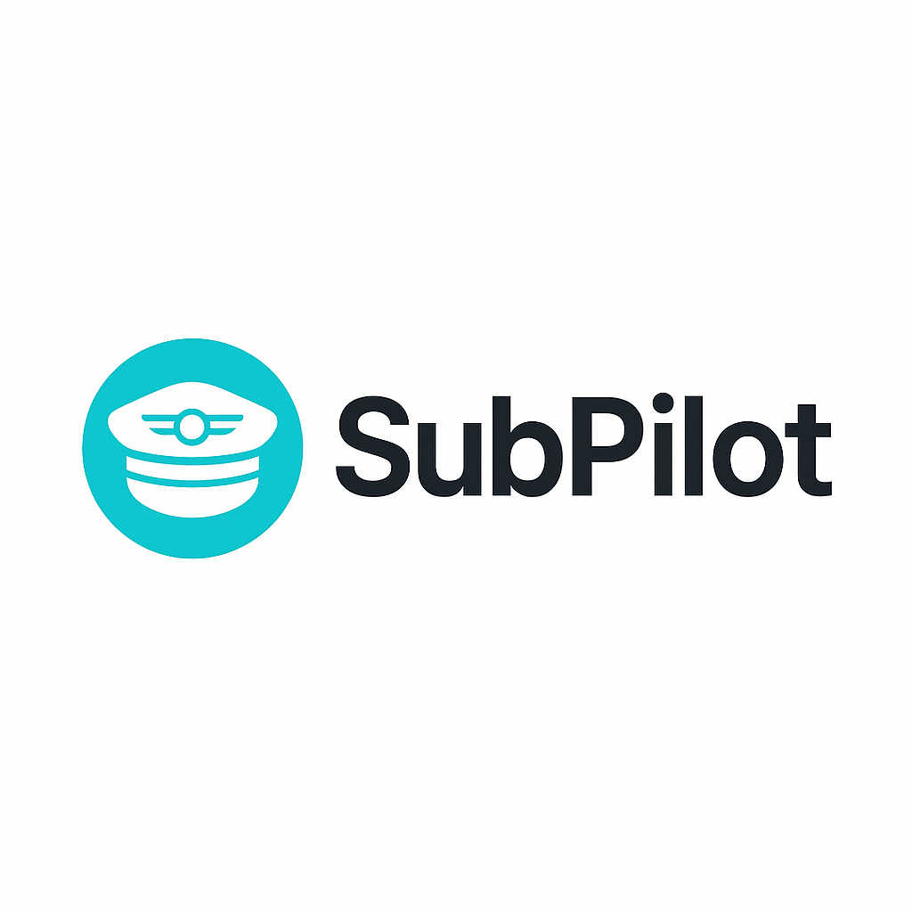

<!-- markdownlint-disable MD033 -->
# SubPilot - Subscription Management Platform

<div align="center">
  
  <h3>Your command center for recurring finances</h3>
  <p>A modern web platform for monitoring, managing, and canceling subscriptions</p>
  
  <p><strong>🎉 Phase 3 Complete: v1.5.0 - Major UI/UX Enhancements + Complete Admin Panel!</strong></p>
  <p><strong>Current Version:</strong> v1.5.0 | <strong>Live Demo:</strong> <a href="https://subpilot-test.vercel.app">subpilot-test.vercel.app</a></p>
  <p><strong>Status:</strong> Phase 3 Complete ✅ | Ready for Phase 4 - Launch & Marketing</p>
  <p><strong>Latest:</strong> Complete Admin Panel + Banks Management + Help System + Enhanced Analytics ✅</p>
</div>

## 🚀 Quick Start

```bash
# Clone the repository
git clone https://github.com/doublegate/subpilot-app.git
cd subpilot-app

# Install dependencies
npm install

# Set up environment variables
cp .env.example .env.local
# Edit .env.local with your configuration

# Set up database
npx prisma generate
npx prisma db push

# Start development server
npm run dev
```

Open [http://localhost:3000](http://localhost:3000) in your browser.

## 📋 Overview

SubPilot is a comprehensive subscription management platform built with the **T3 Stack** that helps users:

- 📊 **Monitor subscriptions** with an interactive dashboard
- 🏦 **Connect bank accounts** via Plaid integration
- 🤖 **Smart categorization** of recurring transactions
- 🔔 **Get alerts** for renewals and trial endings
- ❌ **Cancel subscriptions** directly from the platform
- 📈 **Analyze spending** with detailed reports

## 🛠️ Tech Stack

- **Frontend**: [Next.js 14](https://nextjs.org/) + [TypeScript](https://www.typescriptlang.org/)
- **Styling**: [Tailwind CSS](https://tailwindcss.com/) + [shadcn/ui](https://ui.shadcn.com/)
- **Backend**: [tRPC](https://trpc.io/) for type-safe APIs
- **Database**: [PostgreSQL](https://www.postgresql.org/) + [Prisma ORM](https://www.prisma.io/)
- **Authentication**: [Auth.js](https://authjs.dev/) (OAuth + Magic Links)
- **Bank Integration**: [Plaid API](https://plaid.com/)
- **Deployment**: [Vercel](https://vercel.com/) + [Railway](https://railway.app/)

## 🏗️ Project Structure

```ascii
subpilot-app/
├── docs/                   # Documentation
├── src/
│   ├── app/               # Next.js App Router
│   ├── components/        # React components
│   ├── server/           # tRPC API routes
│   ├── lib/              # Utilities and configs
│   └── styles/           # Global styles
├── prisma/               # Database schema
├── public/               # Static assets
└── css_theme/            # Design system
```

## 🎯 Development Phases

### Phase 1: MVP (100% Complete) ✅

- ✅ Project setup and branding
- ✅ User authentication (OAuth + Magic Links)
- ✅ Bank integration (Plaid)
- ✅ Subscription dashboard with analytics
- ✅ Email notifications system
- ✅ Theme system (Light/Dark/Auto)
- ✅ 99.5% test coverage
- ✅ Production deployment

### Phase 2: Advanced Features (100% Complete) ✅

- ✅ Smart AI categorization with OpenAI GPT-4
- ✅ Advanced analytics and predictive insights
- ✅ Data export functionality (CSV, JSON, PDF, Excel)
- ✅ Progressive Web App (PWA) with offline support
- ✅ Mobile optimization with touch gestures

### Phase 3: Automation (100% Complete) ✅

- ✅ Unified cancellation system with three-agent architecture
- ✅ AI assistant integration with GPT-4 conversation management
- ✅ Premium features with Stripe billing integration
- ✅ Background job processing and workflow orchestration
- ✅ Real-time updates via Server-Sent Events

### Phase 4: Launch & Marketing (Ready to Begin)

- Production optimization and scaling
- Marketing site development
- Native mobile applications
- API platform for integrations

## 📚 Documentation

### Core Documentation
- **[Development Setup](./DEVELOPMENT_SETUP.md)** - Complete local environment setup
- **[Architecture](./ARCHITECTURE.md)** - System design and T3 Stack integration
- **[API Reference](./API_REFERENCE.md)** - tRPC endpoints and schemas
- **[Database Design](./DATABASE_DESIGN.md)** - Prisma models and relationships
- **[Authentication Guide](./AUTHENTICATION.md)** - Auth.js implementation
- **[Bank Integration](./BANK_INTEGRATION.md)** - Plaid API setup
- **[Testing Guide](./TESTING_GUIDE.md)** - Unit and E2E testing
- **[Documentation Index](./DOCUMENTATION_REFERENCE_INDEX.md)** - Complete documentation reference

### Archived Documentation
Phase 1 completed documentation has been archived at [`archive/phase-1-completion/`](../archive/phase-1-completion/) including:
- Implementation reports and summaries
- Code quality and performance audits
- Completed setup guides
- Historical release notes

## 🧑‍💻 Developer Resources

- **[Quick Start Guide](./QUICK_START.md)** - Get running in 15 minutes
- **[UI Components](./UI_COMPONENTS.md)** - shadcn/ui component usage
- **[Project Roadmap](./PROJECT_ROADMAP.md)** - Development phases and timeline
- **[Quick Reference](./QUICK-REFERENCE.md)** - Common commands and workflows

## 🎨 Design System

SubPilot uses a custom Tailwind theme with:

- **Primary**: Cyan (#06B6D4) - Trust and clarity
- **Accent**: Purple (#9333EA) - Premium and modern
- **Typography**: Inter font family
- **Components**: Based on shadcn/ui library

## 🔒 Security & Privacy

- 🔐 All data encrypted in transit (TLS) and at rest
- 🏦 No banking credentials stored directly
- 👤 User-controlled data deletion and GDPR compliance
- 🛡️ OWASP security hardening

## 🤝 Contributing

1. Fork the repository
2. Create a feature branch: `git checkout -b feature/amazing-feature`
3. Commit changes: `git commit -m 'Add amazing feature'`
4. Push to branch: `git push origin feature/amazing-feature`
5. Open a Pull Request

See [CONTRIBUTING.md](./CONTRIBUTING.md) for detailed guidelines.

## 📝 License

This project is licensed under the MIT License - see the [LICENSE](../LICENSE) file for details.

## 🆘 Support

- 📖 Check the [Documentation](./docs/)
- 🐛 Report bugs via [GitHub Issues](https://github.com/your-org/subpilot-app/issues)
- 💬 Join our [Discord Community](https://discord.gg/subpilot)
- 📧 Email: <support@subpilot.com>

---

## Recent Updates (2025-06-29)

### v1.5.0 - Major UI/UX Enhancements
- **Complete Admin Panel**: Full admin dashboard with user management, billing, and system monitoring
- **Banks Management Page**: Dedicated interface for managing connected bank accounts
- **Help & Support System**: Comprehensive help center with FAQ accordion and quick actions
- **Enhanced Analytics**: Interactive 3x4 month heatmap with click-through navigation
- **TypeScript Excellence**: Zero compilation errors across entire codebase
- **CI/CD Fixes**: Fixed dynamic import issues in seed scripts

---

## Made with ❤️ by the SubPilot Team

*Last Updated: 2025-06-29 22:53 EDT*
<!-- markdownlint-enable MD033 -->
