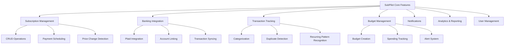

# SubPilot Feature Development Guide

**Last Updated**: 2025-06-26 12:24 AM EDT

## Overview

This guide provides detailed implementation strategies for building SubPilot's core features using the Next.js, tRPC, Prisma, and Radix UI stack. Each feature is broken down into implementation steps with code examples.

## Core Features Architecture



## 1. Subscription Management System

### Feature Overview

Comprehensive subscription lifecycle management including creation, modification, tracking, and cancellation assistance.

### Database Schema Extensions

```prisma
model Subscription {
  id              String              @id @default(cuid())
  name            String
  description     String?
  amount          Float
  currency        String              @default("USD")
  frequency       SubscriptionFrequency
  category        String?
  nextPayment     DateTime
  isActive        Boolean             @default(true)
  isPaused        Boolean             @default(false)
  pausedUntil     DateTime?
  reminderDays    Int                 @default(3)
  notes           String?
  
  // Price tracking
  priceHistory    PriceHistory[]
  
  // External integration
  externalId      String?             // Plaid transaction ID
  merchantInfo    Json?               // Logo, website, etc.
  
  // Cancellation assistance
  cancellationUrl String?
  customerService String?
  
  userId          String
  createdAt       DateTime            @default(now())
  updatedAt       DateTime            @updatedAt

  user         User          @relation(fields: [userId], references: [id], onDelete: Cascade)
  transactions Transaction[]
  reminders    Reminder[]

  @@map("subscriptions")
}

model PriceHistory {
  id             String       @id @default(cuid())
  subscriptionId String
  oldAmount      Float
  newAmount      Float
  changeDate     DateTime     @default(now())
  changeReason   String?
  
  subscription   Subscription @relation(fields: [subscriptionId], references: [id], onDelete: Cascade)
  
  @@map("price_history")
}

model Reminder {
  id             String       @id @default(cuid())
  subscriptionId String
  reminderDate   DateTime
  type           ReminderType
  isRead         Boolean      @default(false)
  message        String
  
  subscription   Subscription @relation(fields: [subscriptionId], references: [id], onDelete: Cascade)
  
  @@map("reminders")
}

enum ReminderType {
  PAYMENT_DUE
  PRICE_CHANGE
  CANCELLATION_REMINDER
  TRIAL_ENDING
}
```

### tRPC Router Implementation

```typescript
// server/routers/subscriptions.ts
import { z } from 'zod';
import { router, protectedProcedure } from '../trpc';
import { TRPCError } from '@trpc/server';

const subscriptionCreateSchema = z.object({
  name: z.string().min(1).max(100),
  description: z.string().optional(),
  amount: z.number().positive().max(10000),
  frequency: z.enum(['WEEKLY', 'MONTHLY', 'QUARTERLY', 'YEARLY']),
  category: z.string().optional(),
  nextPayment: z.date(),
  reminderDays: z.number().min(0).max(30).default(3),
  notes: z.string().optional(),
});

export const subscriptionsRouter = router({
  // Get all subscriptions with filtering and sorting
  getAll: protectedProcedure
    .input(z.object({
      category: z.string().optional(),
      isActive: z.boolean().optional(),
      sortBy: z.enum(['name', 'amount', 'nextPayment', 'createdAt']).default('nextPayment'),
      sortOrder: z.enum(['asc', 'desc']).default('asc'),
    }))
    .query(async ({ ctx, input }) => {
      const { category, isActive, sortBy, sortOrder } = input;
      
      return ctx.prisma.subscription.findMany({
        where: {
          userId: ctx.user.id,
          ...(category && { category }),
          ...(isActive !== undefined && { isActive }),
        },
        include: {
          _count: {
            select: { transactions: true },
          },
          priceHistory: {
            orderBy: { changeDate: 'desc' },
            take: 1,
          },
        },
        orderBy: { [sortBy]: sortOrder },
      });
    }),

  // Get upcoming payments
  getUpcoming: protectedProcedure
    .input(z.object({
      days: z.number().min(1).max(90).default(30),
    }))
    .query(async ({ ctx, input }) => {
      const futureDate = new Date();
      futureDate.setDate(futureDate.getDate() + input.days);

      return ctx.prisma.subscription.findMany({
        where: {
          userId: ctx.user.id,
          isActive: true,
          nextPayment: {
            lte: futureDate,
          },
        },
        orderBy: { nextPayment: 'asc' },
      });
    }),

  // Create subscription with price tracking
  create: protectedProcedure
    .input(subscriptionCreateSchema)
    .mutation(async ({ ctx, input }) => {
      const subscription = await ctx.prisma.subscription.create({
        data: {
          ...input,
          userId: ctx.user.id,
        },
      });

      // Schedule payment reminder
      await schedulePaymentReminder(subscription);

      return subscription;
    }),

  // Update subscription with price change tracking
  update: protectedProcedure
    .input(z.object({
      id: z.string(),
      data: subscriptionCreateSchema.partial(),
    }))
    .mutation(async ({ ctx, input }) => {
      const existing = await ctx.prisma.subscription.findFirst({
        where: { id: input.id, userId: ctx.user.id },
      });

      if (!existing) {
        throw new TRPCError({ code: 'NOT_FOUND' });
      }

      // Track price changes
      if (input.data.amount && input.data.amount !== existing.amount) {
        await ctx.prisma.priceHistory.create({
          data: {
            subscriptionId: input.id,
            oldAmount: existing.amount,
            newAmount: input.data.amount,
            changeReason: 'Manual update',
          },
        });
      }

      return ctx.prisma.subscription.update({
        where: { id: input.id },
        data: input.data,
      });
    }),

  // Pause/unpause subscription
  togglePause: protectedProcedure
    .input(z.object({
      id: z.string(),
      pausedUntil: z.date().optional(),
    }))
    .mutation(async ({ ctx, input }) => {
      const subscription = await ctx.prisma.subscription.findFirst({
        where: { id: input.id, userId: ctx.user.id },
      });

      if (!subscription) {
        throw new TRPCError({ code: 'NOT_FOUND' });
      }

      return ctx.prisma.subscription.update({
        where: { id: input.id },
        data: {
          isPaused: !subscription.isPaused,
          pausedUntil: input.pausedUntil,
        },
      });
    }),

  // Get subscription analytics
  getAnalytics: protectedProcedure
    .input(z.object({
      period: z.enum(['month', 'quarter', 'year']).default('month'),
    }))
    .query(async ({ ctx, input }) => {
      const subscriptions = await ctx.prisma.subscription.findMany({
        where: { userId: ctx.user.id, isActive: true },
      });

      const analytics = subscriptions.reduce((acc, sub) => {
        const monthlyAmount = calculateMonthlyAmount(sub.amount, sub.frequency);
        
        acc.totalMonthly += monthlyAmount;
        acc.byCategory[sub.category || 'Uncategorized'] = 
          (acc.byCategory[sub.category || 'Uncategorized'] || 0) + monthlyAmount;
        
        return acc;
      }, {
        totalMonthly: 0,
        byCategory: {} as Record<string, number>,
        count: subscriptions.length,
      });

      return analytics;
    }),
});

// Utility function
function calculateMonthlyAmount(amount: number, frequency: string): number {
  switch (frequency) {
    case 'WEEKLY': return amount * 4.33;
    case 'MONTHLY': return amount;
    case 'QUARTERLY': return amount / 3;
    case 'YEARLY': return amount / 12;
    default: return amount;
  }
}
```

### React Components

```typescript
// components/subscriptions/SubscriptionCard.tsx
import { Card, Flex, Text, Button, Badge } from '@radix-ui/themes';
import { CalendarIcon, PauseIcon, PlayIcon } from '@radix-ui/react-icons';
import { trpc } from '../../utils/trpc';
import { formatCurrency, formatDate } from '../../utils/format';

interface SubscriptionCardProps {
  subscription: {
    id: string;
    name: string;
    amount: number;
    frequency: string;
    nextPayment: Date;
    isActive: boolean;
    isPaused: boolean;
    category?: string;
  };
}

export function SubscriptionCard({ subscription }: SubscriptionCardProps) {
  const utils = trpc.useContext();
  const togglePause = trpc.subscriptions.togglePause.useMutation({
    onSuccess: () => {
      utils.subscriptions.getAll.invalidate();
    },
  });

  const handleTogglePause = () => {
    togglePause.mutate({ id: subscription.id });
  };

  return (
    <Card className="p-4">
      <Flex direction="column" gap="3">
        <Flex justify="between" align="center">
          <Text size="4" weight="bold">{subscription.name}</Text>
          {subscription.category && (
            <Badge color="blue">{subscription.category}</Badge>
          )}
        </Flex>
        
        <Flex justify="between" align="center">
          <Text size="3" weight="medium">
            {formatCurrency(subscription.amount)}/{subscription.frequency.toLowerCase()}
          </Text>
          <Flex align="center" gap="1">
            <CalendarIcon />
            <Text size="2" color="gray">
              {formatDate(subscription.nextPayment)}
            </Text>
          </Flex>
        </Flex>
        
        <Flex gap="2">
          <Button
            variant="outline"
            size="1"
            onClick={handleTogglePause}
            disabled={togglePause.isLoading}
          >
            {subscription.isPaused ? <PlayIcon /> : <PauseIcon />}
            {subscription.isPaused ? 'Resume' : 'Pause'}
          </Button>
          
          <Button variant="soft" size="1">
            Manage
          </Button>
        </Flex>
      </Flex>
    </Card>
  );
}
```

## 2. Banking Integration with Plaid

### Feature Overview

Secure bank account linking, transaction synchronization, and automatic subscription detection.

### Plaid Integration Setup

```typescript
// lib/plaid.ts
import { PlaidApi, PlaidEnvironments, Configuration } from 'plaid';

const configuration = new Configuration({
  basePath: PlaidEnvironments[process.env.PLAID_ENV as keyof typeof PlaidEnvironments],
  baseOptions: {
    headers: {
      'PLAID-CLIENT-ID': process.env.PLAID_CLIENT_ID,
      'PLAID-SECRET': process.env.PLAID_SECRET,
    },
  },
});

export const plaidClient = new PlaidApi(configuration);

// Plaid service
export class PlaidService {
  async createLinkToken(userId: string) {
    const request = {
      user: { client_user_id: userId },
      client_name: 'SubPilot',
      products: ['transactions'],
      country_codes: ['US'],
      language: 'en',
    };

    const response = await plaidClient.linkTokenCreate(request);
    return response.data.link_token;
  }

  async exchangePublicToken(publicToken: string, userId: string) {
    const response = await plaidClient.itemPublicTokenExchange({
      public_token: publicToken,
    });

    const accessToken = response.data.access_token;
    const itemId = response.data.item_id;

    // Store access token securely
    await prisma.plaidAccount.create({
      data: {
        userId,
        accessToken: encrypt(accessToken),
        itemId,
        isActive: true,
      },
    });

    return { accessToken, itemId };
  }

  async getTransactions(accessToken: string, startDate: Date, endDate: Date) {
    const response = await plaidClient.transactionsGet({
      access_token: accessToken,
      start_date: startDate.toISOString().split('T')[0],
      end_date: endDate.toISOString().split('T')[0],
    });

    return response.data.transactions;
  }

  async syncTransactions(userId: string) {
    const accounts = await prisma.plaidAccount.findMany({
      where: { userId, isActive: true },
    });

    for (const account of accounts) {
      const accessToken = decrypt(account.accessToken);
      const endDate = new Date();
      const startDate = new Date();
      startDate.setDate(endDate.getDate() - 30);

      const transactions = await this.getTransactions(accessToken, startDate, endDate);
      
      // Process and store transactions
      await this.processTransactions(transactions, userId);
    }
  }

  private async processTransactions(transactions: any[], userId: string) {
    for (const transaction of transactions) {
      // Check if transaction already exists
      const existing = await prisma.transaction.findFirst({
        where: { externalId: transaction.transaction_id },
      });

      if (existing) continue;

      // Detect if this is a subscription payment
      const subscription = await this.detectSubscription(transaction, userId);

      await prisma.transaction.create({
        data: {
          externalId: transaction.transaction_id,
          amount: Math.abs(transaction.amount),
          description: transaction.merchant_name || transaction.name,
          category: transaction.category?.[0] || 'Other',
          type: transaction.amount > 0 ? 'INCOME' : 'EXPENSE',
          date: new Date(transaction.date),
          userId,
          subscriptionId: subscription?.id,
          metadata: transaction,
        },
      });
    }
  }

  private async detectSubscription(transaction: any, userId: string) {
    const subscriptions = await prisma.subscription.findMany({
      where: { userId, isActive: true },
    });

    // Simple name matching for subscription detection
    for (const subscription of subscriptions) {
      const merchantName = transaction.merchant_name?.toLowerCase() || '';
      const subscriptionName = subscription.name.toLowerCase();
      
      if (merchantName.includes(subscriptionName) || 
          subscriptionName.includes(merchantName)) {
        
        // Update next payment date
        const nextPayment = calculateNextPayment(
          subscription.frequency,
          new Date(transaction.date)
        );
        
        await prisma.subscription.update({
          where: { id: subscription.id },
          data: { nextPayment },
        });
        
        return subscription;
      }
    }

    return null;
  }
}
```

### Banking Router

```typescript
// server/routers/banking.ts
import { z } from 'zod';
import { router, protectedProcedure } from '../trpc';
import { PlaidService } from '../../lib/plaid';

const plaidService = new PlaidService();

export const bankingRouter = router({
  // Create Plaid Link token
  createLinkToken: protectedProcedure.mutation(async ({ ctx }) => {
    const linkToken = await plaidService.createLinkToken(ctx.user.id);
    return { linkToken };
  }),

  // Exchange public token for access token
  linkAccount: protectedProcedure
    .input(z.object({
      publicToken: z.string(),
      metadata: z.object({
        institution: z.object({
          name: z.string(),
          institution_id: z.string(),
        }),
      }),
    }))
    .mutation(async ({ ctx, input }) => {
      const { accessToken, itemId } = await plaidService.exchangePublicToken(
        input.publicToken,
        ctx.user.id
      );

      // Store account information
      await ctx.prisma.connectedAccount.create({
        data: {
          userId: ctx.user.id,
          institutionName: input.metadata.institution.name,
          institutionId: input.metadata.institution.institution_id,
          itemId,
          isActive: true,
        },
      });

      // Start initial transaction sync
      await plaidService.syncTransactions(ctx.user.id);

      return { success: true };
    }),

  // Get connected accounts
  getAccounts: protectedProcedure.query(async ({ ctx }) => {
    return ctx.prisma.connectedAccount.findMany({
      where: { userId: ctx.user.id, isActive: true },
    });
  }),

  // Manually sync transactions
  syncTransactions: protectedProcedure.mutation(async ({ ctx }) => {
    await plaidService.syncTransactions(ctx.user.id);
    return { success: true };
  }),

  // Get transaction insights
  getInsights: protectedProcedure
    .input(z.object({
      months: z.number().min(1).max(12).default(3),
    }))
    .query(async ({ ctx, input }) => {
      const startDate = new Date();
      startDate.setMonth(startDate.getMonth() - input.months);

      const transactions = await ctx.prisma.transaction.findMany({
        where: {
          userId: ctx.user.id,
          date: { gte: startDate },
          type: 'EXPENSE',
        },
        include: {
          subscription: true,
        },
      });

      // Analyze spending patterns
      const insights = {
        totalSpending: transactions.reduce((sum, t) => sum + t.amount, 0),
        subscriptionSpending: transactions
          .filter(t => t.subscription)
          .reduce((sum, t) => sum + t.amount, 0),
        averageTransaction: transactions.length > 0 
          ? transactions.reduce((sum, t) => sum + t.amount, 0) / transactions.length 
          : 0,
        categoryBreakdown: transactions.reduce((acc, t) => {
          acc[t.category] = (acc[t.category] || 0) + t.amount;
          return acc;
        }, {} as Record<string, number>),
      };

      return insights;
    }),
});
```

## 3. Smart Notification System

### Feature Overview

Intelligent notifications for payment reminders, price changes, and budget alerts.

### Notification Schema

```prisma
model Notification {
  id        String           @id @default(cuid())
  userId    String
  type      NotificationType
  title     String
  message   String
  data      Json?
  isRead    Boolean          @default(false)
  sentAt    DateTime?
  createdAt DateTime         @default(now())
  
  user User @relation(fields: [userId], references: [id], onDelete: Cascade)
  
  @@map("notifications")
}

enum NotificationType {
  PAYMENT_REMINDER
  PRICE_INCREASE
  BUDGET_ALERT
  TRIAL_ENDING
  UNUSUAL_CHARGE
  ACCOUNT_CONNECTED
}
```

### Notification Service

```typescript
// services/notificationService.ts
import { PrismaClient } from '@prisma/client';
import { sendEmail } from '../lib/email';
import { sendPushNotification } from '../lib/push';

export class NotificationService {
  constructor(private prisma: PrismaClient) {}

  async sendPaymentReminder(subscription: any) {
    const daysUntilPayment = Math.ceil(
      (new Date(subscription.nextPayment).getTime() - Date.now()) / 
      (1000 * 60 * 60 * 24)
    );

    const notification = await this.prisma.notification.create({
      data: {
        userId: subscription.userId,
        type: 'PAYMENT_REMINDER',
        title: `${subscription.name} payment due soon`,
        message: `Your ${subscription.name} subscription of $${subscription.amount} is due in ${daysUntilPayment} days.`,
        data: {
          subscriptionId: subscription.id,
          amount: subscription.amount,
          daysUntil: daysUntilPayment,
        },
      },
    });

    // Send email notification
    await this.sendEmailNotification(notification);
    
    // Send push notification if enabled
    await this.sendPushNotificationIfEnabled(notification);

    return notification;
  }

  async sendPriceChangeAlert(subscription: any, oldPrice: number, newPrice: number) {
    const increase = newPrice - oldPrice;
    const percentageIncrease = (increase / oldPrice) * 100;

    await this.prisma.notification.create({
      data: {
        userId: subscription.userId,
        type: 'PRICE_INCREASE',
        title: `${subscription.name} price increased`,
        message: `The price for ${subscription.name} increased from $${oldPrice} to $${newPrice} (+${percentageIncrease.toFixed(1)}%).`,
        data: {
          subscriptionId: subscription.id,
          oldPrice,
          newPrice,
          increase,
          percentageIncrease,
        },
      },
    });
  }

  async schedulePaymentReminders() {
    const upcomingPayments = await this.prisma.subscription.findMany({
      where: {
        isActive: true,
        nextPayment: {
          gte: new Date(),
          lte: new Date(Date.now() + 7 * 24 * 60 * 60 * 1000), // Next 7 days
        },
      },
    });

    for (const subscription of upcomingPayments) {
      const daysUntil = Math.ceil(
        (new Date(subscription.nextPayment).getTime() - Date.now()) / 
        (1000 * 60 * 60 * 24)
      );

      if (daysUntil <= subscription.reminderDays) {
        await this.sendPaymentReminder(subscription);
      }
    }
  }

  private async sendEmailNotification(notification: any) {
    const user = await this.prisma.user.findUnique({
      where: { id: notification.userId },
    });

    if (user?.email) {
      await sendEmail({
        to: user.email,
        subject: notification.title,
        template: 'notification',
        data: {
          title: notification.title,
          message: notification.message,
          ...notification.data,
        },
      });
    }
  }

  private async sendPushNotificationIfEnabled(notification: any) {
    // Implementation depends on push notification service
    // (Firebase, Pusher, etc.)
  }
}
```

## 4. Budget Management

### Budget Schema and Implementation

```prisma
model Budget {
  id         String       @id @default(cuid())
  name       String
  amount     Float
  spent      Float        @default(0)
  category   String?
  period     BudgetPeriod
  startDate  DateTime
  endDate    DateTime
  userId     String
  isActive   Boolean      @default(true)
  createdAt  DateTime     @default(now())
  updatedAt  DateTime     @updatedAt
  
  user       User         @relation(fields: [userId], references: [id], onDelete: Cascade)
  alerts     BudgetAlert[]
  
  @@map("budgets")
}

model BudgetAlert {
  id          String    @id @default(cuid())
  budgetId    String
  threshold   Float     // Percentage (e.g., 80 for 80%)
  isTriggered Boolean   @default(false)
  triggeredAt DateTime?
  
  budget      Budget    @relation(fields: [budgetId], references: [id], onDelete: Cascade)
  
  @@map("budget_alerts")
}
```

### Budget Router

```typescript
// server/routers/budgets.ts
export const budgetsRouter = router({
  create: protectedProcedure
    .input(z.object({
      name: z.string().min(1),
      amount: z.number().positive(),
      category: z.string().optional(),
      period: z.enum(['WEEKLY', 'MONTHLY', 'QUARTERLY', 'YEARLY']),
      alertThresholds: z.array(z.number().min(0).max(100)).default([50, 80, 100]),
    }))
    .mutation(async ({ ctx, input }) => {
      const { alertThresholds, ...budgetData } = input;
      
      const { startDate, endDate } = calculateBudgetPeriod(input.period);
      
      const budget = await ctx.prisma.budget.create({
        data: {
          ...budgetData,
          startDate,
          endDate,
          userId: ctx.user.id,
        },
      });

      // Create alert thresholds
      await ctx.prisma.budgetAlert.createMany({
        data: alertThresholds.map(threshold => ({
          budgetId: budget.id,
          threshold,
        })),
      });

      return budget;
    }),

  getProgress: protectedProcedure
    .input(z.object({ id: z.string() }))
    .query(async ({ ctx, input }) => {
      const budget = await ctx.prisma.budget.findFirst({
        where: { id: input.id, userId: ctx.user.id },
        include: { alerts: true },
      });

      if (!budget) {
        throw new TRPCError({ code: 'NOT_FOUND' });
      }

      // Calculate spending in budget period
      const transactions = await ctx.prisma.transaction.findMany({
        where: {
          userId: ctx.user.id,
          type: 'EXPENSE',
          date: {
            gte: budget.startDate,
            lte: budget.endDate,
          },
          ...(budget.category && { category: budget.category }),
        },
      });

      const spent = transactions.reduce((sum, t) => sum + t.amount, 0);
      const percentage = (spent / budget.amount) * 100;
      const remaining = budget.amount - spent;

      // Update spent amount
      await ctx.prisma.budget.update({
        where: { id: budget.id },
        data: { spent },
      });

      return {
        ...budget,
        spent,
        percentage,
        remaining,
        isOverBudget: spent > budget.amount,
      };
    }),
});
```

## 5. Analytics Dashboard

### Analytics Schema

```prisma
model AnalyticsSnapshot {
  id                  String   @id @default(cuid())
  userId              String
  period              String   // 'YYYY-MM' format
  totalSubscriptions  Int
  totalSpending       Float
  averagePerMonth     Float
  categoriesData      Json
  trendsData          Json
  createdAt          DateTime @default(now())
  
  user               User     @relation(fields: [userId], references: [id], onDelete: Cascade)
  
  @@unique([userId, period])
  @@map("analytics_snapshots")
}
```

### Analytics Service

```typescript
// services/analyticsService.ts
export class AnalyticsService {
  constructor(private prisma: PrismaClient) {}

  async generateMonthlyReport(userId: string, month: string) {
    const startDate = new Date(`${month}-01`);
    const endDate = new Date(startDate.getFullYear(), startDate.getMonth() + 1, 0);

    const [subscriptions, transactions] = await Promise.all([
      this.prisma.subscription.findMany({
        where: { userId, isActive: true },
      }),
      this.prisma.transaction.findMany({
        where: {
          userId,
          date: { gte: startDate, lte: endDate },
          type: 'EXPENSE',
        },
        include: { subscription: true },
      }),
    ]);

    const analytics = {
      totalSubscriptions: subscriptions.length,
      totalSpending: transactions.reduce((sum, t) => sum + t.amount, 0),
      subscriptionSpending: transactions
        .filter(t => t.subscription)
        .reduce((sum, t) => sum + t.amount, 0),
      categoryBreakdown: this.calculateCategoryBreakdown(transactions),
      trends: await this.calculateTrends(userId, startDate),
    };

    await this.prisma.analyticsSnapshot.upsert({
      where: { userId_period: { userId, period: month } },
      create: {
        userId,
        period: month,
        totalSubscriptions: analytics.totalSubscriptions,
        totalSpending: analytics.totalSpending,
        averagePerMonth: analytics.totalSpending,
        categoriesData: analytics.categoryBreakdown,
        trendsData: analytics.trends,
      },
      update: {
        totalSubscriptions: analytics.totalSubscriptions,
        totalSpending: analytics.totalSpending,
        averagePerMonth: analytics.totalSpending,
        categoriesData: analytics.categoryBreakdown,
        trendsData: analytics.trends,
      },
    });

    return analytics;
  }

  private calculateCategoryBreakdown(transactions: any[]) {
    return transactions.reduce((acc, transaction) => {
      const category = transaction.category || 'Uncategorized';
      acc[category] = (acc[category] || 0) + transaction.amount;
      return acc;
    }, {} as Record<string, number>);
  }

  private async calculateTrends(userId: string, currentMonth: Date) {
    const previousMonths = Array.from({ length: 6 }, (_, i) => {
      const date = new Date(currentMonth);
      date.setMonth(date.getMonth() - i - 1);
      return date.toISOString().slice(0, 7);
    }).reverse();

    const trends = await Promise.all(
      previousMonths.map(async (month) => {
        const snapshot = await this.prisma.analyticsSnapshot.findUnique({
          where: { userId_period: { userId, period: month } },
        });
        
        return {
          month,
          spending: snapshot?.totalSpending || 0,
          subscriptions: snapshot?.totalSubscriptions || 0,
        };
      })
    );

    return trends;
  }
}
```

## 6. Analytics Dashboard UI Components

### Upcoming Renewals Calendar

The calendar component provides a visual representation of upcoming subscription renewals with proper overflow handling.

```typescript
// components/analytics/upcoming-renewals-calendar.tsx
import { Calendar } from '@/components/ui/calendar';
import { Tooltip, TooltipContent, TooltipProvider, TooltipTrigger } from '@/components/ui/tooltip';
import { formatCurrency } from '@/lib/utils';

export function UpcomingRenewalsCalendar({ subscriptions }) {
  const getSubscriptionsForDate = (date: Date) => {
    return subscriptions.filter(sub => 
      isSameDay(new Date(sub.nextPaymentDate), date)
    );
  };

  return (
    <Card>
      <CardHeader>
        <CardTitle>Upcoming Renewals</CardTitle>
      </CardHeader>
      <CardContent>
        <Calendar
          mode="single"
          className="rounded-md border"
          components={{
            Day: ({ date, ...props }) => {
              const daySubscriptions = getSubscriptionsForDate(date);
              
              return (
                <div className="relative h-24 overflow-hidden p-1">
                  <DayNumber>{date.getDate()}</DayNumber>
                  
                  {/* Show first 2 subscriptions */}
                  {daySubscriptions.slice(0, 2).map((sub) => (
                    <div
                      key={sub.id}
                      className="text-xs p-1 mb-1 bg-primary/10 rounded truncate"
                      title={`${sub.name} - ${formatCurrency(sub.amount)}`}
                    >
                      {sub.name}
                    </div>
                  ))}
                  
                  {/* Overflow indicator with tooltip */}
                  {daySubscriptions.length > 2 && (
                    <TooltipProvider>
                      <Tooltip>
                        <TooltipTrigger asChild>
                          <div className="text-xs text-muted-foreground hover:text-foreground cursor-help">
                            +{daySubscriptions.length - 2} more
                          </div>
                        </TooltipTrigger>
                        <TooltipContent side="bottom" className="max-w-xs">
                          <div className="space-y-1">
                            {daySubscriptions.slice(2).map((sub) => (
                              <div key={sub.id} className="text-sm">
                                {sub.name} - {formatCurrency(sub.amount)}
                              </div>
                            ))}
                          </div>
                        </TooltipContent>
                      </Tooltip>
                    </TooltipProvider>
                  )}
                </div>
              );
            },
          }}
        />
      </CardContent>
    </Card>
  );
}
```

### Key Analytics UI Features (Updated 2025-06-26)

1. **Calendar Overflow Handling**: Fixed height cells with tooltip for overflow items
2. **Theme Integration**: Full support for light/dark themes across all analytics components
3. **Responsive Design**: Calendar adapts to different screen sizes
4. **Interactive Tooltips**: Hover interactions for detailed information
5. **Performance Optimization**: Efficient rendering of subscription data

This comprehensive feature development guide provides the foundation for building SubPilot's core functionality with proper architecture, security, and scalability considerations.
