# SubPilot System Architecture Overview

## High-Level Architecture

SubPilot follows a modern full-stack architecture pattern with clear separation of concerns and type safety throughout the entire application stack.


## Component Architecture

### Frontend Architecture


### Backend Architecture


## Data Flow Architecture

### Subscription Management Flow


### Transaction Processing Flow


## Database Architecture

### Entity Relationship Diagram


### Data Access Patterns

```typescript
// Repository Pattern Implementation
interface SubscriptionRepository {
  findByUserId(userId: string): Promise<Subscription[]>;
  findUpcoming(days: number): Promise<Subscription[]>;
  create(data: CreateSubscriptionData): Promise<Subscription>;
  update(id: string, data: UpdateSubscriptionData): Promise<Subscription>;
  delete(id: string): Promise<void>;
}

// Service Layer Implementation
class SubscriptionService {
  constructor(
    private subscriptionRepo: SubscriptionRepository,
    private transactionRepo: TransactionRepository,
    private notificationService: NotificationService
  ) {}

  async createSubscription(userId: string, data: CreateSubscriptionData) {
    // Business logic
    const subscription = await this.subscriptionRepo.create({
      ...data,
      userId,
    });

    // Schedule notifications
    await this.notificationService.schedulePaymentReminder(subscription);

    return subscription;
  }
}
```

## Security Architecture

### Authentication & Authorization Flow


### Data Protection Layers


## Caching Strategy

### Multi-Level Caching Architecture


### Cache Invalidation Strategy

```typescript
// Cache invalidation patterns
export const cacheKeys = {
  subscriptions: {
    all: (userId: string) => ['subscriptions', userId] as const,
    byId: (id: string) => ['subscription', id] as const,
    upcoming: (userId: string) => ['subscriptions', 'upcoming', userId] as const,
  },
  transactions: {
    all: (userId: string) => ['transactions', userId] as const,
    byMonth: (userId: string, month: string) => ['transactions', userId, month] as const,
  },
} as const;

// Automatic cache invalidation
export const subscriptionsRouter = router({
  create: protectedProcedure
    .input(createSubscriptionSchema)
    .mutation(async ({ ctx, input }) => {
      const subscription = await ctx.prisma.subscription.create({
        data: { ...input, userId: ctx.user.id },
      });

      // Invalidate related caches
      await ctx.revalidateTag(['subscriptions', ctx.user.id]);
      
      return subscription;
    }),
});
```

## Performance Architecture

### Optimization Strategies


### Database Query Optimization

```typescript
// Optimized Prisma queries
export const getSubscriptionsDashboard = async (userId: string) => {
  return prisma.subscription.findMany({
    where: { userId, isActive: true },
    select: {
      id: true,
      name: true,
      amount: true,
      frequency: true,
      nextPayment: true,
      category: true,
      _count: {
        select: { transactions: true },
      },
    },
    orderBy: { nextPayment: 'asc' },
    take: 20,
  });
};

// Batch loading for N+1 prevention
export const getSubscriptionsWithTransactions = async (userId: string) => {
  const subscriptions = await prisma.subscription.findMany({
    where: { userId },
    include: {
      transactions: {
        orderBy: { date: 'desc' },
        take: 5,
      },
    },
  });

  return subscriptions;
};
```

## Scalability Considerations

### Horizontal Scaling Strategy


### Microservices Evolution Path


## Monitoring & Observability

### Monitoring Stack

```mermaid
graph TD
    A[Application] --> B[Metrics Collection]
    A --> C[Log Aggregation]
    A --> D[Error Tracking]
    A --> E[Performance Monitoring]
    
    B --> F[Prometheus/Grafana]
    C --> G[Structured Logging]
    D --> H[Sentry/Bugsnag]
    E --> I[Web Vitals/Lighthouse]
    
    J[Alerting] --> K[PagerDuty/Slack]
    F --> J
    G --> J
    H --> J
    I --> J
```



### Health Check Architecture

```typescript
// Health check endpoints
export const healthRouter = router({
  ping: publicProcedure.query(() => ({ status: 'ok', timestamp: new Date() })),
  
  database: publicProcedure.query(async ({ ctx }) => {
    try {
      await ctx.prisma.$queryRaw`SELECT 1`;
      return { status: 'healthy', service: 'database' };
    } catch (error) {
      return { status: 'unhealthy', service: 'database', error: error.message };
    }
  }),
  
  external: publicProcedure.query(async () => {
    const checks = await Promise.allSettled([
      checkPlaidConnection(),
      checkEmailService(),
      checkRedisConnection(),
    ]);
    
    return checks.map((check, index) => ({
      service: ['plaid', 'email', 'redis'][index],
      status: check.status === 'fulfilled' ? 'healthy' : 'unhealthy',
      error: check.status === 'rejected' ? check.reason : null,
    }));
  }),
});
```

## Deployment Architecture

### Production Deployment


### Infrastructure as Code

```yaml
# docker-compose.yml for local development
version: '3.8'

services:
  app:
    build: .
    ports:
      - "3000:3000"
    environment:
      - DATABASE_URL=postgresql://postgres:password@db:5432/subpilot
      - REDIS_URL=redis://redis:6379
    depends_on:
      - db
      - redis

  db:
    image: postgres:15
    environment:
      - POSTGRES_DB=subpilot
      - POSTGRES_USER=postgres
      - POSTGRES_PASSWORD=password
    volumes:
      - postgres_data:/var/lib/postgresql/data

  redis:
    image: redis:7-alpine
    volumes:
      - redis_data:/data

volumes:
  postgres_data:
  redis_data:
```

## Error Handling Architecture

### Error Propagation Strategy


### Error Recovery Patterns

```typescript
// Error boundaries and retry logic
export const withRetry = async <T>(
  operation: () => Promise<T>,
  maxRetries = 3,
  delay = 1000
): Promise<T> => {
  for (let i = 0; i < maxRetries; i++) {
    try {
      return await operation();
    } catch (error) {
      if (i === maxRetries - 1) throw error;
      await new Promise(resolve => setTimeout(resolve, delay * Math.pow(2, i)));
    }
  }
  throw new Error('Max retries exceeded');
};

// Circuit breaker pattern
class CircuitBreaker {
  private failures = 0;
  private nextAttempt = Date.now();
  private state: 'closed' | 'open' | 'half-open' = 'closed';

  async execute<T>(operation: () => Promise<T>): Promise<T> {
    if (this.state === 'open') {
      if (this.nextAttempt > Date.now()) {
        throw new Error('Circuit breaker is open');
      }
      this.state = 'half-open';
    }

    try {
      const result = await operation();
      this.onSuccess();
      return result;
    } catch (error) {
      this.onFailure();
      throw error;
    }
  }

  private onSuccess() {
    this.failures = 0;
    this.state = 'closed';
  }

  private onFailure() {
    this.failures++;
    if (this.failures >= 5) {
      this.state = 'open';
      this.nextAttempt = Date.now() + 60000; // 1 minute
    }
  }
}
```

This architecture provides a robust, scalable foundation for SubPilot that can handle the complexities of financial data management while maintaining security, performance, and reliability.
